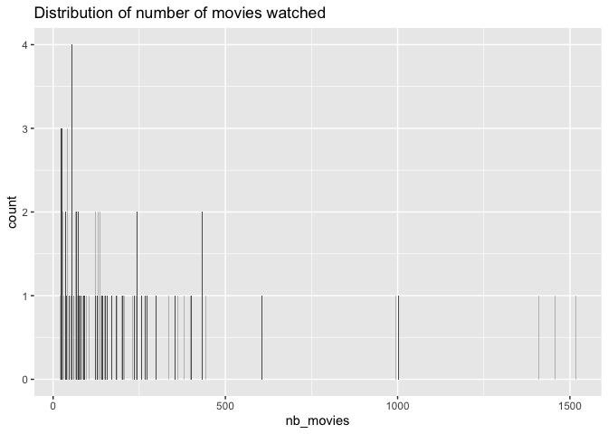
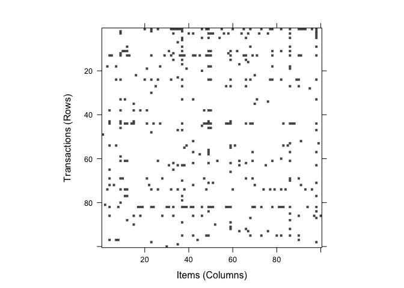
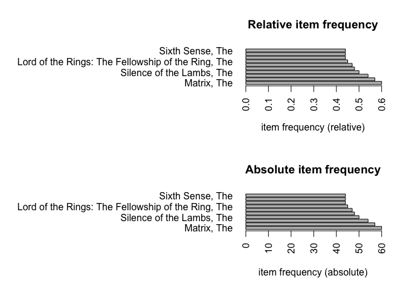
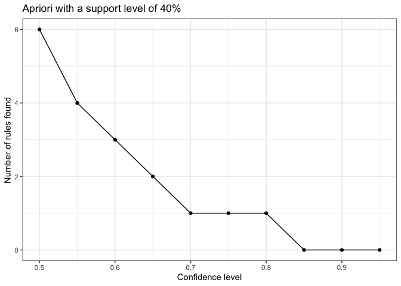
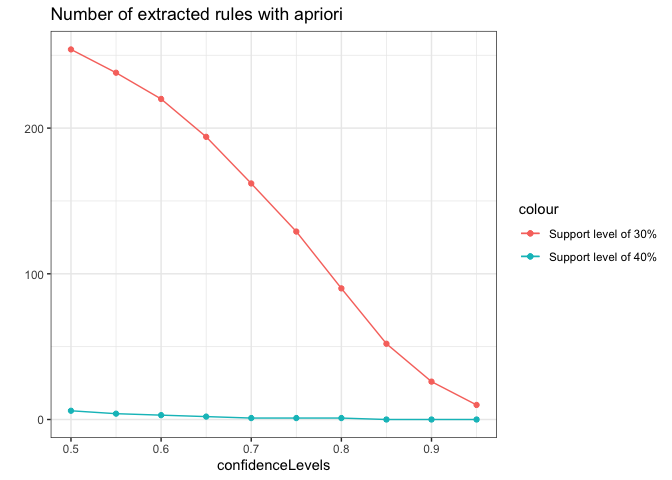
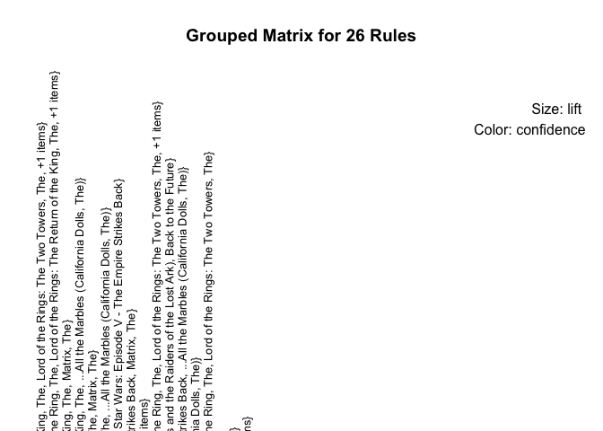
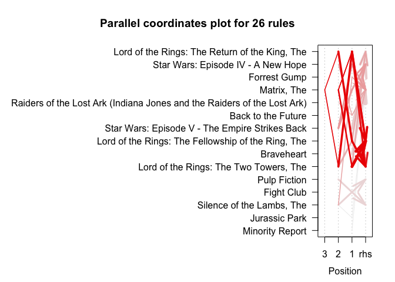

Movie\_Transaction\_Analysis
================
Irene N. Chang
1/26/2021

``` r
library(dplyr)
```

    ## 
    ## Attaching package: 'dplyr'

    ## The following objects are masked from 'package:stats':
    ## 
    ##     filter, lag

    ## The following objects are masked from 'package:base':
    ## 
    ##     intersect, setdiff, setequal, union

``` r
library(ggplot2)
library(arules)
```

    ## Loading required package: Matrix

    ## 
    ## Attaching package: 'arules'

    ## The following object is masked from 'package:dplyr':
    ## 
    ##     recode

    ## The following objects are masked from 'package:base':
    ## 
    ##     abbreviate, write

``` r
library(htmlwidgets)
library(arulesViz)
```

    ## Loading required package: grid

``` r
library(readr)

Movie_subset <- read_csv("Movie_subset.csv")
```

    ## Warning: Missing column names filled in: 'X1' [1]

    ## 
    ## ── Column specification ────────────────────────────────────────────────────────
    ## cols(
    ##   X1 = col_double(),
    ##   userId = col_double(),
    ##   movieId = col_double(),
    ##   title = col_character(),
    ##   year = col_double(),
    ##   genres = col_character()
    ## )

``` r
Movie_subset %>% glimpse()
```

    ## Rows: 19,455
    ## Columns: 6
    ## $ X1      <dbl> 1, 2, 3, 4, 5, 6, 7, 8, 9, 10, 11, 12, 13, 14, 15, 16, 17, 18…
    ## $ userId  <dbl> 1323, 1323, 1323, 1323, 1323, 1323, 1323, 1323, 1323, 1323, 1…
    ## $ movieId <dbl> 1, 3, 5, 10, 11, 12, 15, 16, 17, 19, 21, 22, 23, 29, 31, 34, …
    ## $ title   <chr> "Toy Story", "Grumpier Old Men", "Father of the Bride Part II…
    ## $ year    <dbl> 1995, 1995, 1995, 1995, 1995, 1995, 1995, 1995, 1995, 1995, 1…
    ## $ genres  <chr> "Adventure|Animation|Children|Comedy|Fantasy", "Comedy|Romanc…

``` r
any(is.na(Movie_subset)) ## No missing data
```

    ## [1] FALSE

Number of distinct movies and users

``` r
n_distinct(Movie_subset$userId)
```

    ## [1] 100

``` r
n_distinct(Movie_subset$movieId)
```

    ## [1] 4598

Distribution of the number of movies watched by users

``` r
Movie_subset %>% 
    group_by(userId) %>%
    summarize(nb_movies = n_distinct(movieId)) %>%
    ggplot(aes(x = nb_movies)) +
    geom_bar() +
    ggtitle("Distribution of number of movies watched")
```

    ## `summarise()` ungrouping output (override with `.groups` argument)

<!-- -->

``` r
data_list <- split(Movie_subset$title,
                                    Movie_subset$userId)
movie_trx <- as(data_list, "transactions")
```

    ## Warning in asMethod(object): removing duplicated items in transactions

``` r
image(movie_trx[1:100, 1:100]) ##plot the matrix
```

<!-- -->

``` r
summary(movie_trx) # density: 0.042
```

    ## transactions as itemMatrix in sparse format with
    ##  100 rows (elements/itemsets/transactions) and
    ##  4508 columns (items) and a density of 0.04299246 
    ## 
    ## most frequent items:
    ##               Matrix, The           American Beauty                Fight Club 
    ##                        60                        57                        54 
    ## Silence of the Lambs, The Shawshank Redemption, The                   (Other) 
    ##                        50                        48                     19112 
    ## 
    ## element (itemset/transaction) length distribution:
    ## sizes
    ##   20   22   23   24   26   27   29   36   39   40   45   46   47   50   54   55 
    ##    1    2    3    3    3    2    1    2    1    3    1    1    1    2    2    3 
    ##   58   59   64   68   69   73   74   76   77   81   85   88   89   90   91   96 
    ##    1    1    2    2    1    2    1    1    1    1    1    1    1    1    1    1 
    ##  103  120  121  123  127  129  134  135  140  141  144  147  151  156  170  182 
    ##    1    1    1    1    1    2    2    1    1    1    1    1    2    1    1    1 
    ##  183  198  199  201  202  206  229  235  238  243  244  253  257  267  273  299 
    ##    1    1    1    1    1    1    1    1    1    1    1    1    1    1    1    1 
    ##  331  354  358  379  392  400  432  433  441  602  990  998 1401 1450 1505 
    ##    1    1    1    1    1    1    1    1    1    1    1    1    1    1    1 
    ## 
    ##    Min. 1st Qu.  Median    Mean 3rd Qu.    Max. 
    ##    20.0    50.0    99.5   193.8   211.8  1505.0 
    ## 
    ## includes extended item information - examples:
    ##                                       labels
    ## 1 ...All the Marbles (California Dolls, The)
    ## 2                     ...And Justice for All
    ## 3                                'burbs, The
    ## 
    ## includes extended transaction information - examples:
    ##   transactionID
    ## 1          1323
    ## 2          1913
    ## 3          2029

Frequency plots

``` r
par(mfrow=c(2, 1))
itemFrequencyPlot(movie_trx,
                                    type = "relative",
                                    topN = 10,
                                    horiz = TRUE,
                                    main = 'Relative item frequency')
itemFrequencyPlot(movie_trx,
                                    type = "absolute",
                                    topN = 10,
                                    horiz=T,
                                    main = "Absolute item frequency")
```

<!-- -->

``` r
#Least popular items
par(mar=c(2,20,2,2), mfrow=c(1,1))
barplot(sort(table(unlist(LIST(movie_trx))))[1:10],
                horiz = TRUE,
                las = 1,
                main = 'Least popular items')
```

<!-- -->

Mining the dataset

``` r
itemsets <- apriori(movie_trx, parameter = list(support = 0.4,
                                                                                                target = 'frequent itemsets'))
```

    ## Apriori
    ## 
    ## Parameter specification:
    ##  confidence minval smax arem  aval originalSupport maxtime support minlen
    ##          NA    0.1    1 none FALSE            TRUE       5     0.4      1
    ##  maxlen            target  ext
    ##      10 frequent itemsets TRUE
    ## 
    ## Algorithmic control:
    ##  filter tree heap memopt load sort verbose
    ##     0.1 TRUE TRUE  FALSE TRUE    2    TRUE
    ## 
    ## Absolute minimum support count: 40 
    ## 
    ## set item appearances ...[0 item(s)] done [0.00s].
    ## set transactions ...[4508 item(s), 100 transaction(s)] done [0.01s].
    ## sorting and recoding items ... [15 item(s)] done [0.00s].
    ## creating transaction tree ... done [0.00s].
    ## checking subsets of size 1 2 done [0.00s].
    ## sorting transactions ... done [0.00s].
    ## writing ... [16 set(s)] done [0.00s].
    ## creating S4 object  ... done [0.00s].

``` r
inspect(sort(itemsets, by = "support", decreasing = T)[1:5]) # 5 most popular items
```

    ##     items                       support transIdenticalToItemsets count
    ## [1] {Matrix, The}               0.60    0.03                     60   
    ## [2] {American Beauty}           0.57    0.00                     57   
    ## [3] {Fight Club}                0.54    0.01                     54   
    ## [4] {Silence of the Lambs, The} 0.50    0.00                     50   
    ## [5] {Shawshank Redemption, The} 0.48    0.00                     48

Extract the set of most frequent itemsets

``` r
itemsets_minlen2 = apriori(movie_trx, parameter = 
                                                        list(support = 0.3,
                                                                 minlen = 2,
                                                                 target = 'frequent'
                                                        ))
```

    ## Apriori
    ## 
    ## Parameter specification:
    ##  confidence minval smax arem  aval originalSupport maxtime support minlen
    ##          NA    0.1    1 none FALSE            TRUE       5     0.3      2
    ##  maxlen            target  ext
    ##      10 frequent itemsets TRUE
    ## 
    ## Algorithmic control:
    ##  filter tree heap memopt load sort verbose
    ##     0.1 TRUE TRUE  FALSE TRUE    2    TRUE
    ## 
    ## Absolute minimum support count: 30 
    ## 
    ## set item appearances ...[0 item(s)] done [0.00s].
    ## set transactions ...[4508 item(s), 100 transaction(s)] done [0.01s].
    ## sorting and recoding items ... [56 item(s)] done [0.00s].
    ## creating transaction tree ... done [0.00s].
    ## checking subsets of size 1 2 3 4 done [0.00s].
    ## sorting transactions ... done [0.00s].
    ## writing ... [115 set(s)] done [0.00s].
    ## creating S4 object  ... done [0.00s].

``` r
# Inspect the five most popular items
inspect(sort(itemsets_minlen2, 
                         by='support', decreasing = T)[1:5])
```

    ##     items                                                support transIdenticalToItemsets count
    ## [1] {Matrix, The,                                                                              
    ##      Silence of the Lambs, The}                             0.40                        0    40
    ## [2] {Lord of the Rings: The Fellowship of the Ring, The,                                       
    ##      Lord of the Rings: The Two Towers, The}                0.38                        0    38
    ## [3] {American Beauty,                                                                          
    ##      Pulp Fiction}                                          0.38                        0    38
    ## [4] {Pulp Fiction,                                                                             
    ##      Silence of the Lambs, The}                             0.38                        0    38
    ## [5] {Matrix, The,                                                                              
    ##      Star Wars: Episode IV - A New Hope}                    0.38                        0    38

``` r
# 5 least popular 
inspect(sort(itemsets_minlen2, 
                         by='support', decreasing = F)[1:5])
```

    ##     items                                           support
    ## [1] {Matrix, The,Minority Report}                   0.3    
    ## [2] {Matrix, The,Shrek}                             0.3    
    ## [3] {Pulp Fiction,Schindler's List}                 0.3    
    ## [4] {Braveheart,Jurassic Park}                      0.3    
    ## [5] {Braveheart,Star Wars: Episode IV - A New Hope} 0.3    
    ##     transIdenticalToItemsets count
    ## [1] 0                        30   
    ## [2] 0                        30   
    ## [3] 0                        30   
    ## [4] 0                        30   
    ## [5] 0                        30

Pick the parameters

``` r
# Number of extracted rules with varying conf levels and supp level of 40%
confidenceLevels = seq(from=0.95, to=0.5, by=-0.05)
rules_sup04 = NULL
for (i in 1:length(confidenceLevels)) {
    rules_sup04[i] = 
        length(apriori(movie_trx,
                                     parameter=list(sup=0.4, 
                                                                 conf=confidenceLevels[i],
                                                                 target="rules")))
}
```

    ## Apriori
    ## 
    ## Parameter specification:
    ##  confidence minval smax arem  aval originalSupport maxtime support minlen
    ##        0.95    0.1    1 none FALSE            TRUE       5     0.4      1
    ##  maxlen target  ext
    ##      10  rules TRUE
    ## 
    ## Algorithmic control:
    ##  filter tree heap memopt load sort verbose
    ##     0.1 TRUE TRUE  FALSE TRUE    2    TRUE
    ## 
    ## Absolute minimum support count: 40 
    ## 
    ## set item appearances ...[0 item(s)] done [0.00s].
    ## set transactions ...[4508 item(s), 100 transaction(s)] done [0.01s].
    ## sorting and recoding items ... [15 item(s)] done [0.00s].
    ## creating transaction tree ... done [0.00s].
    ## checking subsets of size 1 2 done [0.00s].
    ## writing ... [0 rule(s)] done [0.00s].
    ## creating S4 object  ... done [0.00s].
    ## Apriori
    ## 
    ## Parameter specification:
    ##  confidence minval smax arem  aval originalSupport maxtime support minlen
    ##         0.9    0.1    1 none FALSE            TRUE       5     0.4      1
    ##  maxlen target  ext
    ##      10  rules TRUE
    ## 
    ## Algorithmic control:
    ##  filter tree heap memopt load sort verbose
    ##     0.1 TRUE TRUE  FALSE TRUE    2    TRUE
    ## 
    ## Absolute minimum support count: 40 
    ## 
    ## set item appearances ...[0 item(s)] done [0.00s].
    ## set transactions ...[4508 item(s), 100 transaction(s)] done [0.01s].
    ## sorting and recoding items ... [15 item(s)] done [0.00s].
    ## creating transaction tree ... done [0.00s].
    ## checking subsets of size 1 2 done [0.00s].
    ## writing ... [0 rule(s)] done [0.00s].
    ## creating S4 object  ... done [0.00s].
    ## Apriori
    ## 
    ## Parameter specification:
    ##  confidence minval smax arem  aval originalSupport maxtime support minlen
    ##        0.85    0.1    1 none FALSE            TRUE       5     0.4      1
    ##  maxlen target  ext
    ##      10  rules TRUE
    ## 
    ## Algorithmic control:
    ##  filter tree heap memopt load sort verbose
    ##     0.1 TRUE TRUE  FALSE TRUE    2    TRUE
    ## 
    ## Absolute minimum support count: 40 
    ## 
    ## set item appearances ...[0 item(s)] done [0.00s].
    ## set transactions ...[4508 item(s), 100 transaction(s)] done [0.01s].
    ## sorting and recoding items ... [15 item(s)] done [0.00s].
    ## creating transaction tree ... done [0.00s].
    ## checking subsets of size 1 2 done [0.00s].
    ## writing ... [0 rule(s)] done [0.00s].
    ## creating S4 object  ... done [0.00s].
    ## Apriori
    ## 
    ## Parameter specification:
    ##  confidence minval smax arem  aval originalSupport maxtime support minlen
    ##         0.8    0.1    1 none FALSE            TRUE       5     0.4      1
    ##  maxlen target  ext
    ##      10  rules TRUE
    ## 
    ## Algorithmic control:
    ##  filter tree heap memopt load sort verbose
    ##     0.1 TRUE TRUE  FALSE TRUE    2    TRUE
    ## 
    ## Absolute minimum support count: 40 
    ## 
    ## set item appearances ...[0 item(s)] done [0.00s].
    ## set transactions ...[4508 item(s), 100 transaction(s)] done [0.01s].
    ## sorting and recoding items ... [15 item(s)] done [0.00s].
    ## creating transaction tree ... done [0.00s].
    ## checking subsets of size 1 2 done [0.00s].
    ## writing ... [1 rule(s)] done [0.00s].
    ## creating S4 object  ... done [0.00s].
    ## Apriori
    ## 
    ## Parameter specification:
    ##  confidence minval smax arem  aval originalSupport maxtime support minlen
    ##        0.75    0.1    1 none FALSE            TRUE       5     0.4      1
    ##  maxlen target  ext
    ##      10  rules TRUE
    ## 
    ## Algorithmic control:
    ##  filter tree heap memopt load sort verbose
    ##     0.1 TRUE TRUE  FALSE TRUE    2    TRUE
    ## 
    ## Absolute minimum support count: 40 
    ## 
    ## set item appearances ...[0 item(s)] done [0.00s].
    ## set transactions ...[4508 item(s), 100 transaction(s)] done [0.01s].
    ## sorting and recoding items ... [15 item(s)] done [0.00s].
    ## creating transaction tree ... done [0.00s].
    ## checking subsets of size 1 2 done [0.00s].
    ## writing ... [1 rule(s)] done [0.00s].
    ## creating S4 object  ... done [0.00s].
    ## Apriori
    ## 
    ## Parameter specification:
    ##  confidence minval smax arem  aval originalSupport maxtime support minlen
    ##         0.7    0.1    1 none FALSE            TRUE       5     0.4      1
    ##  maxlen target  ext
    ##      10  rules TRUE
    ## 
    ## Algorithmic control:
    ##  filter tree heap memopt load sort verbose
    ##     0.1 TRUE TRUE  FALSE TRUE    2    TRUE
    ## 
    ## Absolute minimum support count: 40 
    ## 
    ## set item appearances ...[0 item(s)] done [0.00s].
    ## set transactions ...[4508 item(s), 100 transaction(s)] done [0.01s].
    ## sorting and recoding items ... [15 item(s)] done [0.00s].
    ## creating transaction tree ... done [0.00s].
    ## checking subsets of size 1 2 done [0.00s].
    ## writing ... [1 rule(s)] done [0.00s].
    ## creating S4 object  ... done [0.00s].
    ## Apriori
    ## 
    ## Parameter specification:
    ##  confidence minval smax arem  aval originalSupport maxtime support minlen
    ##        0.65    0.1    1 none FALSE            TRUE       5     0.4      1
    ##  maxlen target  ext
    ##      10  rules TRUE
    ## 
    ## Algorithmic control:
    ##  filter tree heap memopt load sort verbose
    ##     0.1 TRUE TRUE  FALSE TRUE    2    TRUE
    ## 
    ## Absolute minimum support count: 40 
    ## 
    ## set item appearances ...[0 item(s)] done [0.00s].
    ## set transactions ...[4508 item(s), 100 transaction(s)] done [0.01s].
    ## sorting and recoding items ... [15 item(s)] done [0.00s].
    ## creating transaction tree ... done [0.00s].
    ## checking subsets of size 1 2 done [0.00s].
    ## writing ... [2 rule(s)] done [0.00s].
    ## creating S4 object  ... done [0.00s].
    ## Apriori
    ## 
    ## Parameter specification:
    ##  confidence minval smax arem  aval originalSupport maxtime support minlen
    ##         0.6    0.1    1 none FALSE            TRUE       5     0.4      1
    ##  maxlen target  ext
    ##      10  rules TRUE
    ## 
    ## Algorithmic control:
    ##  filter tree heap memopt load sort verbose
    ##     0.1 TRUE TRUE  FALSE TRUE    2    TRUE
    ## 
    ## Absolute minimum support count: 40 
    ## 
    ## set item appearances ...[0 item(s)] done [0.00s].
    ## set transactions ...[4508 item(s), 100 transaction(s)] done [0.01s].
    ## sorting and recoding items ... [15 item(s)] done [0.00s].
    ## creating transaction tree ... done [0.00s].
    ## checking subsets of size 1 2 done [0.00s].
    ## writing ... [3 rule(s)] done [0.00s].
    ## creating S4 object  ... done [0.00s].
    ## Apriori
    ## 
    ## Parameter specification:
    ##  confidence minval smax arem  aval originalSupport maxtime support minlen
    ##        0.55    0.1    1 none FALSE            TRUE       5     0.4      1
    ##  maxlen target  ext
    ##      10  rules TRUE
    ## 
    ## Algorithmic control:
    ##  filter tree heap memopt load sort verbose
    ##     0.1 TRUE TRUE  FALSE TRUE    2    TRUE
    ## 
    ## Absolute minimum support count: 40 
    ## 
    ## set item appearances ...[0 item(s)] done [0.00s].
    ## set transactions ...[4508 item(s), 100 transaction(s)] done [0.01s].
    ## sorting and recoding items ... [15 item(s)] done [0.00s].
    ## creating transaction tree ... done [0.00s].
    ## checking subsets of size 1 2 done [0.00s].
    ## writing ... [4 rule(s)] done [0.00s].
    ## creating S4 object  ... done [0.00s].
    ## Apriori
    ## 
    ## Parameter specification:
    ##  confidence minval smax arem  aval originalSupport maxtime support minlen
    ##         0.5    0.1    1 none FALSE            TRUE       5     0.4      1
    ##  maxlen target  ext
    ##      10  rules TRUE
    ## 
    ## Algorithmic control:
    ##  filter tree heap memopt load sort verbose
    ##     0.1 TRUE TRUE  FALSE TRUE    2    TRUE
    ## 
    ## Absolute minimum support count: 40 
    ## 
    ## set item appearances ...[0 item(s)] done [0.00s].
    ## set transactions ...[4508 item(s), 100 transaction(s)] done [0.01s].
    ## sorting and recoding items ... [15 item(s)] done [0.00s].
    ## creating transaction tree ... done [0.00s].
    ## checking subsets of size 1 2 done [0.00s].
    ## writing ... [6 rule(s)] done [0.00s].
    ## creating S4 object  ... done [0.00s].

``` r
qplot(confidenceLevels, rules_sup04, 
            geom=c("point", "line"),xlab="Confidence level",
            ylab="Number of rules found", 
            main="Apriori with a support level of 40%") +
    theme_bw()
```

<!-- -->

``` r
rules_sup03 <- c(10, 26, 52, 90, 129, 162, 194, 220, 238, 254)
nb_rules <- data.frame(rules_sup04, rules_sup03,
                                            confidenceLevels)
ggplot(data=nb_rules, aes(x=confidenceLevels)) +
    # Lines and points for rules_sup04
    geom_line(aes(y=rules_sup04, colour="Support level of 40%")) + 
    geom_point(aes(y=rules_sup04,colour="Support level of 40%")) +
    # Lines and points for rules_sup03
    geom_line(aes(y=rules_sup03, colour="Support level of 30%")) +
    geom_point(aes(y=rules_sup03,colour="Support level of 30%")) + 
    # Polishing the graph
    theme_bw() + ylab("") +
    ggtitle("Number of extracted rules with apriori")
```

<!-- -->

``` r
# choose min support of 30% and confidence of 90%
```

### EXTRACT MOVIES RULES

``` r
# Extract rules with the apriori
rules_movies = apriori(movie_trx,
                                             parameter = list(supp = 0.3,
                                                                             conf = 0.9,
                                                                             minlen = 2, 
                                                                             target = "rules"))
```

    ## Apriori
    ## 
    ## Parameter specification:
    ##  confidence minval smax arem  aval originalSupport maxtime support minlen
    ##         0.9    0.1    1 none FALSE            TRUE       5     0.3      2
    ##  maxlen target  ext
    ##      10  rules TRUE
    ## 
    ## Algorithmic control:
    ##  filter tree heap memopt load sort verbose
    ##     0.1 TRUE TRUE  FALSE TRUE    2    TRUE
    ## 
    ## Absolute minimum support count: 30 
    ## 
    ## set item appearances ...[0 item(s)] done [0.00s].
    ## set transactions ...[4508 item(s), 100 transaction(s)] done [0.01s].
    ## sorting and recoding items ... [56 item(s)] done [0.00s].
    ## creating transaction tree ... done [0.00s].
    ## checking subsets of size 1 2 3 4 done [0.00s].
    ## writing ... [26 rule(s)] done [0.00s].
    ## creating S4 object  ... done [0.00s].

``` r
summary(rules_movies)
```

    ## set of 26 rules
    ## 
    ## rule length distribution (lhs + rhs):sizes
    ##  2  3  4 
    ##  8 15  3 
    ## 
    ##    Min. 1st Qu.  Median    Mean 3rd Qu.    Max. 
    ##   2.000   2.000   3.000   2.808   3.000   4.000 
    ## 
    ## summary of quality measures:
    ##     support         confidence        coverage           lift      
    ##  Min.   :0.3000   Min.   :0.9091   Min.   :0.3100   Min.   :1.515  
    ##  1st Qu.:0.3100   1st Qu.:0.9216   1st Qu.:0.3300   1st Qu.:1.568  
    ##  Median :0.3400   Median :0.9394   Median :0.3500   Median :2.191  
    ##  Mean   :0.3315   Mean   :0.9536   Mean   :0.3481   Mean   :2.095  
    ##  3rd Qu.:0.3500   3rd Qu.:1.0000   3rd Qu.:0.3700   3rd Qu.:2.558  
    ##  Max.   :0.3800   Max.   :1.0000   Max.   :0.3900   Max.   :2.632  
    ##      count      
    ##  Min.   :30.00  
    ##  1st Qu.:31.00  
    ##  Median :34.00  
    ##  Mean   :33.15  
    ##  3rd Qu.:35.00  
    ##  Max.   :38.00  
    ## 
    ## mining info:
    ##       data ntransactions support confidence
    ##  movie_trx           100     0.3        0.9

``` r
# top rules by lift
inspect(head(sort(rules_movies, by = "lift", decreasing = T), 5))
```

    ##     lhs                                                     rhs                                              support confidence coverage     lift count
    ## [1] {Lord of the Rings: The Fellowship of the Ring, The,                                                                                               
    ##      Lord of the Rings: The Return of the King, The}     => {Lord of the Rings: The Two Towers, The}            0.35  1.0000000     0.35 2.631579    35
    ## [2] {Lord of the Rings: The Return of the King, The,                                                                                                   
    ##      Matrix, The}                                        => {Lord of the Rings: The Two Towers, The}            0.31  1.0000000     0.31 2.631579    31
    ## [3] {Lord of the Rings: The Fellowship of the Ring, The,                                                                                               
    ##      Lord of the Rings: The Return of the King, The,                                                                                                   
    ##      Matrix, The}                                        => {Lord of the Rings: The Two Towers, The}            0.31  1.0000000     0.31 2.631579    31
    ## [4] {Lord of the Rings: The Two Towers, The,                                                                                                           
    ##      Matrix, The}                                        => {Lord of the Rings: The Return of the King, The}    0.31  0.9393939     0.33 2.609428    31
    ## [5] {Lord of the Rings: The Fellowship of the Ring, The,                                                                                               
    ##      Lord of the Rings: The Two Towers, The,                                                                                                           
    ##      Matrix, The}                                        => {Lord of the Rings: The Return of the King, The}    0.31  0.9393939     0.33 2.609428    31

``` r
rules_red = is.redundant(rules_movies)
rules.pruned = rules_movies[!rules_red]
inspect(head(sort(rules.pruned, by="confidence")))
```

    ##     lhs                                                     rhs                                                  support confidence coverage     lift count
    ## [1] {Lord of the Rings: The Two Towers, The}             => {Lord of the Rings: The Fellowship of the Ring, The}    0.38  1.0000000     0.38 2.222222    38
    ## [2] {Lord of the Rings: The Fellowship of the Ring, The,                                                                                                   
    ##      Lord of the Rings: The Return of the King, The}     => {Lord of the Rings: The Two Towers, The}                0.35  1.0000000     0.35 2.631579    35
    ## [3] {Lord of the Rings: The Return of the King, The,                                                                                                       
    ##      Matrix, The}                                        => {Lord of the Rings: The Two Towers, The}                0.31  1.0000000     0.31 2.631579    31
    ## [4] {Lord of the Rings: The Return of the King, The,                                                                                                       
    ##      Matrix, The}                                        => {Lord of the Rings: The Fellowship of the Ring, The}    0.31  1.0000000     0.31 2.222222    31
    ## [5] {Lord of the Rings: The Return of the King, The}     => {Lord of the Rings: The Two Towers, The}                0.35  0.9722222     0.36 2.558480    35
    ## [6] {Lord of the Rings: The Return of the King, The}     => {Lord of the Rings: The Fellowship of the Ring, The}    0.35  0.9722222     0.36 2.160494    35

``` r
inspectDT(rules_movies)
```

<!--html_preserve-->

<div id="htmlwidget-558f043ed86ab044049a" class="datatables html-widget" style="width:100%;height:auto;">

</div>

<script type="application/json" data-for="htmlwidget-558f043ed86ab044049a">{"x":{"filter":"top","filterHTML":"<tr>\n  <td><\/td>\n  <td data-type=\"character\" style=\"vertical-align: top;\">\n    <div class=\"form-group has-feedback\" style=\"margin-bottom: auto;\">\n      <input type=\"search\" placeholder=\"All\" class=\"form-control\" style=\"width: 100%;\"/>\n      <span class=\"glyphicon glyphicon-remove-circle form-control-feedback\"><\/span>\n    <\/div>\n  <\/td>\n  <td data-type=\"character\" style=\"vertical-align: top;\">\n    <div class=\"form-group has-feedback\" style=\"margin-bottom: auto;\">\n      <input type=\"search\" placeholder=\"All\" class=\"form-control\" style=\"width: 100%;\"/>\n      <span class=\"glyphicon glyphicon-remove-circle form-control-feedback\"><\/span>\n    <\/div>\n  <\/td>\n  <td data-type=\"number\" style=\"vertical-align: top;\">\n    <div class=\"form-group has-feedback\" style=\"margin-bottom: auto;\">\n      <input type=\"search\" placeholder=\"All\" class=\"form-control\" style=\"width: 100%;\"/>\n      <span class=\"glyphicon glyphicon-remove-circle form-control-feedback\"><\/span>\n    <\/div>\n    <div style=\"display: none; position: absolute; width: 200px;\">\n      <div data-min=\"0.3\" data-max=\"0.38\" data-scale=\"2\"><\/div>\n      <span style=\"float: left;\"><\/span>\n      <span style=\"float: right;\"><\/span>\n    <\/div>\n  <\/td>\n  <td data-type=\"number\" style=\"vertical-align: top;\">\n    <div class=\"form-group has-feedback\" style=\"margin-bottom: auto;\">\n      <input type=\"search\" placeholder=\"All\" class=\"form-control\" style=\"width: 100%;\"/>\n      <span class=\"glyphicon glyphicon-remove-circle form-control-feedback\"><\/span>\n    <\/div>\n    <div style=\"display: none; position: absolute; width: 200px;\">\n      <div data-min=\"0.909090909090909\" data-max=\"1\" data-scale=\"15\"><\/div>\n      <span style=\"float: left;\"><\/span>\n      <span style=\"float: right;\"><\/span>\n    <\/div>\n  <\/td>\n  <td data-type=\"number\" style=\"vertical-align: top;\">\n    <div class=\"form-group has-feedback\" style=\"margin-bottom: auto;\">\n      <input type=\"search\" placeholder=\"All\" class=\"form-control\" style=\"width: 100%;\"/>\n      <span class=\"glyphicon glyphicon-remove-circle form-control-feedback\"><\/span>\n    <\/div>\n    <div style=\"display: none; position: absolute; width: 200px;\">\n      <div data-min=\"0.31\" data-max=\"0.39\" data-scale=\"15\"><\/div>\n      <span style=\"float: left;\"><\/span>\n      <span style=\"float: right;\"><\/span>\n    <\/div>\n  <\/td>\n  <td data-type=\"number\" style=\"vertical-align: top;\">\n    <div class=\"form-group has-feedback\" style=\"margin-bottom: auto;\">\n      <input type=\"search\" placeholder=\"All\" class=\"form-control\" style=\"width: 100%;\"/>\n      <span class=\"glyphicon glyphicon-remove-circle form-control-feedback\"><\/span>\n    <\/div>\n    <div style=\"display: none; position: absolute; width: 200px;\">\n      <div data-min=\"1.51515151515151\" data-max=\"2.63157894736842\" data-scale=\"15\"><\/div>\n      <span style=\"float: left;\"><\/span>\n      <span style=\"float: right;\"><\/span>\n    <\/div>\n  <\/td>\n  <td data-type=\"integer\" style=\"vertical-align: top;\">\n    <div class=\"form-group has-feedback\" style=\"margin-bottom: auto;\">\n      <input type=\"search\" placeholder=\"All\" class=\"form-control\" style=\"width: 100%;\"/>\n      <span class=\"glyphicon glyphicon-remove-circle form-control-feedback\"><\/span>\n    <\/div>\n    <div style=\"display: none; position: absolute; width: 200px;\">\n      <div data-min=\"30\" data-max=\"38\"><\/div>\n      <span style=\"float: left;\"><\/span>\n      <span style=\"float: right;\"><\/span>\n    <\/div>\n  <\/td>\n<\/tr>","data":[["[1]","[2]","[3]","[4]","[5]","[6]","[7]","[8]","[9]","[10]","[11]","[12]","[13]","[14]","[15]","[16]","[17]","[18]","[19]","[20]","[21]","[22]","[23]","[24]","[25]","[26]"],["{Lord of the Rings: The Return of the King, The}","{Lord of the Rings: The Two Towers, The}","{Lord of the Rings: The Return of the King, The}","{Minority Report}","{Lord of the Rings: The Two Towers, The}","{Braveheart}","{Star Wars: Episode V - The Empire Strikes Back}","{Star Wars: Episode V - The Empire Strikes Back}","{Lord of the Rings: The Return of the King, The,Lord of the Rings: The Two Towers, The}","{Lord of the Rings: The Fellowship of the Ring, The,Lord of the Rings: The Return of the King, The}","{Lord of the Rings: The Fellowship of the Ring, The,Lord of the Rings: The Two Towers, The}","{Lord of the Rings: The Return of the King, The,Matrix, The}","{Lord of the Rings: The Two Towers, The,Matrix, The}","{Lord of the Rings: The Return of the King, The,Matrix, The}","{Lord of the Rings: The Two Towers, The,Matrix, The}","{Jurassic Park,Silence of the Lambs, The}","{Star Wars: Episode IV - A New Hope,Star Wars: Episode V - The Empire Strikes Back}","{Matrix, The,Star Wars: Episode V - The Empire Strikes Back}","{Fight Club,Pulp Fiction}","{Fight Club,Silence of the Lambs, The}","{Back to the Future,Raiders of the Lost Ark (Indiana Jones and the Raiders of the Lost Ark)}","{Forrest Gump,Silence of the Lambs, The}","{Back to the Future,Star Wars: Episode IV - A New Hope}","{Lord of the Rings: The Return of the King, The,Lord of the Rings: The Two Towers, The,Matrix, The}","{Lord of the Rings: The Fellowship of the Ring, The,Lord of the Rings: The Return of the King, The,Matrix, The}","{Lord of the Rings: The Fellowship of the Ring, The,Lord of the Rings: The Two Towers, The,Matrix, The}"],["{Lord of the Rings: The Two Towers, The}","{Lord of the Rings: The Return of the King, The}","{Lord of the Rings: The Fellowship of the Ring, The}","{Matrix, The}","{Lord of the Rings: The Fellowship of the Ring, The}","{Matrix, The}","{Star Wars: Episode IV - A New Hope}","{Matrix, The}","{Lord of the Rings: The Fellowship of the Ring, The}","{Lord of the Rings: The Two Towers, The}","{Lord of the Rings: The Return of the King, The}","{Lord of the Rings: The Two Towers, The}","{Lord of the Rings: The Return of the King, The}","{Lord of the Rings: The Fellowship of the Ring, The}","{Lord of the Rings: The Fellowship of the Ring, The}","{Matrix, The}","{Matrix, The}","{Star Wars: Episode IV - A New Hope}","{Silence of the Lambs, The}","{Pulp Fiction}","{Matrix, The}","{Matrix, The}","{Matrix, The}","{Lord of the Rings: The Fellowship of the Ring, The}","{Lord of the Rings: The Two Towers, The}","{Lord of the Rings: The Return of the King, The}"],[0.35,0.35,0.35,0.3,0.38,0.35,0.36,0.36,0.35,0.35,0.35,0.31,0.31,0.31,0.33,0.3,0.34,0.34,0.34,0.34,0.3,0.31,0.31,0.31,0.31,0.31],[0.972222222222222,0.921052631578947,0.972222222222222,0.909090909090909,1,0.921052631578947,0.923076923076923,0.923076923076923,1,1,0.921052631578947,1,0.939393939393939,1,1,0.909090909090909,0.944444444444444,0.944444444444444,0.918918918918919,0.918918918918919,0.9375,0.939393939393939,0.939393939393939,1,1,0.939393939393939],[0.36,0.38,0.36,0.33,0.38,0.38,0.39,0.39,0.35,0.35,0.38,0.31,0.33,0.31,0.33,0.33,0.36,0.36,0.37,0.37,0.32,0.33,0.33,0.31,0.31,0.33],[2.55847953216374,2.55847953216374,2.16049382716049,1.51515151515152,2.22222222222222,1.53508771929825,2.0979020979021,1.53846153846154,2.22222222222222,2.63157894736842,2.55847953216374,2.63157894736842,2.60942760942761,2.22222222222222,2.22222222222222,1.51515151515152,1.57407407407407,2.14646464646465,1.83783783783784,1.9551466359977,1.5625,1.56565656565657,1.56565656565657,2.22222222222222,2.63157894736842,2.60942760942761],[35,35,35,30,38,35,36,36,35,35,35,31,31,31,33,30,34,34,34,34,30,31,31,31,31,31]],"container":"<table class=\"display\">\n  <thead>\n    <tr>\n      <th> <\/th>\n      <th>LHS<\/th>\n      <th>RHS<\/th>\n      <th>support<\/th>\n      <th>confidence<\/th>\n      <th>coverage<\/th>\n      <th>lift<\/th>\n      <th>count<\/th>\n    <\/tr>\n  <\/thead>\n<\/table>","options":{"columnDefs":[{"targets":3,"render":"function(data, type, row, meta) {\n    return type !== 'display' ? data : DTWidget.formatRound(data, 3, 3, \",\", \".\");\n  }"},{"targets":4,"render":"function(data, type, row, meta) {\n    return type !== 'display' ? data : DTWidget.formatRound(data, 3, 3, \",\", \".\");\n  }"},{"targets":5,"render":"function(data, type, row, meta) {\n    return type !== 'display' ? data : DTWidget.formatRound(data, 3, 3, \",\", \".\");\n  }"},{"targets":6,"render":"function(data, type, row, meta) {\n    return type !== 'display' ? data : DTWidget.formatRound(data, 3, 3, \",\", \".\");\n  }"},{"targets":7,"render":"function(data, type, row, meta) {\n    return type !== 'display' ? data : DTWidget.formatRound(data, 3, 3, \",\", \".\");\n  }"},{"targets":8,"render":"function(data, type, row, meta) {\n    return type !== 'display' ? data : DTWidget.formatRound(data, 3, 3, \",\", \".\");\n  }"},{"className":"dt-right","targets":[3,4,5,6,7]},{"orderable":false,"targets":0}],"order":[],"autoWidth":false,"orderClasses":false,"orderCellsTop":true}},"evals":["options.columnDefs.0.render","options.columnDefs.1.render","options.columnDefs.2.render","options.columnDefs.3.render","options.columnDefs.4.render","options.columnDefs.5.render"],"jsHooks":[]}</script>

<!--/html_preserve-->

Plot rules interactive

``` r
plot(rules_movies,
         measure = c("confidence", "lift"),
         shading = "support",
         jitter = 1,
         engine = "html")
```

<!--html_preserve-->

<div id="htmlwidget-ec7f8ee2ddbfa0611a48" class="plotly html-widget" style="width:672px;height:480px;">

</div>

<script type="application/json" data-for="htmlwidget-ec7f8ee2ddbfa0611a48">{"x":{"visdat":{"9eb562179da":["function () ","plotlyVisDat"]},"cur_data":"9eb562179da","attrs":{"9eb562179da":{"x":[0.909080087891532,0.908980343520611,0.937184065397462,0.999997769924714,0.939174951607817,0.999965795552782,0.939661758809056,0.939185062766411,0.999811057420705,1.00027937194436,0.939355323628841,0.999954215268179,0.944434271071593,0.944627201270578,0.91880926033568,0.918897504553503,0.972194543283841,0.920888380748594,0.9721900392228,0.920923531971657,1.00021491740413,0.999924240791102,0.921151021367269,0.923163204398056,0.923149806090172,1.00009089252764],"y":[1.51553600930278,1.51492867728383,1.5620746007869,2.63164828945805,2.6094136454594,2.22254786925867,1.56523137910548,1.56515010688711,2.22211484204151,2.63152971764316,2.60942082889095,2.22168446839687,1.5742947645926,2.1458904763769,1.83794088993037,1.95570673798158,2.55879460314947,2.55803681266081,2.16040374872214,1.53520599198369,2.22235690940099,2.63153891108471,2.55891982016933,2.09752292053031,1.53905237895831,2.22178382228671],"hoverinfo":"text","text":["[4]<BR> <B>{Minority Report}<\/B><BR>&nbsp;&nbsp; => <B>{Matrix, The}<\/B> <BR><BR>confidence: 0.909 <BR>lift: 1.52 <BR>support: 0.3","[16]<BR> <B>{Jurassic Park,<BR>&nbsp;&nbsp;Silence of the Lambs, The}<\/B><BR>&nbsp;&nbsp; => <B>{Matrix, The}<\/B> <BR><BR>confidence: 0.909 <BR>lift: 1.52 <BR>support: 0.3","[21]<BR> <B>{Back to the Future,<BR>&nbsp;&nbsp;Raiders of the Lost Ark (Indiana Jones and the Raiders of the Lost Ark)}<\/B><BR>&nbsp;&nbsp; => <B>{Matrix, The}<\/B> <BR><BR>confidence: 0.938 <BR>lift: 1.56 <BR>support: 0.3","[12]<BR> <B>{Lord of the Rings: The Return of the King, The,<BR>&nbsp;&nbsp;Matrix, The}<\/B><BR>&nbsp;&nbsp; => <B>{Lord of the Rings: The Two Towers, The}<\/B> <BR><BR>confidence: 1 <BR>lift: 2.63 <BR>support: 0.31","[13]<BR> <B>{Lord of the Rings: The Two Towers, The,<BR>&nbsp;&nbsp;Matrix, The}<\/B><BR>&nbsp;&nbsp; => <B>{Lord of the Rings: The Return of the King, The}<\/B> <BR><BR>confidence: 0.939 <BR>lift: 2.61 <BR>support: 0.31","[14]<BR> <B>{Lord of the Rings: The Return of the King, The,<BR>&nbsp;&nbsp;Matrix, The}<\/B><BR>&nbsp;&nbsp; => <B>{Lord of the Rings: The Fellowship of the Ring, The}<\/B> <BR><BR>confidence: 1 <BR>lift: 2.22 <BR>support: 0.31","[22]<BR> <B>{Forrest Gump,<BR>&nbsp;&nbsp;Silence of the Lambs, The}<\/B><BR>&nbsp;&nbsp; => <B>{Matrix, The}<\/B> <BR><BR>confidence: 0.939 <BR>lift: 1.57 <BR>support: 0.31","[23]<BR> <B>{Back to the Future,<BR>&nbsp;&nbsp;Star Wars: Episode IV - A New Hope}<\/B><BR>&nbsp;&nbsp; => <B>{Matrix, The}<\/B> <BR><BR>confidence: 0.939 <BR>lift: 1.57 <BR>support: 0.31","[24]<BR> <B>{Lord of the Rings: The Return of the King, The,<BR>&nbsp;&nbsp;Lord of the Rings: The Two Towers, The,<BR>&nbsp;&nbsp;Matrix, The}<\/B><BR>&nbsp;&nbsp; => <B>{Lord of the Rings: The Fellowship of the Ring, The}<\/B> <BR><BR>confidence: 1 <BR>lift: 2.22 <BR>support: 0.31","[25]<BR> <B>{Lord of the Rings: The Fellowship of the Ring, The,<BR>&nbsp;&nbsp;Lord of the Rings: The Return of the King, The,<BR>&nbsp;&nbsp;Matrix, The}<\/B><BR>&nbsp;&nbsp; => <B>{Lord of the Rings: The Two Towers, The}<\/B> <BR><BR>confidence: 1 <BR>lift: 2.63 <BR>support: 0.31","[26]<BR> <B>{Lord of the Rings: The Fellowship of the Ring, The,<BR>&nbsp;&nbsp;Lord of the Rings: The Two Towers, The,<BR>&nbsp;&nbsp;Matrix, The}<\/B><BR>&nbsp;&nbsp; => <B>{Lord of the Rings: The Return of the King, The}<\/B> <BR><BR>confidence: 0.939 <BR>lift: 2.61 <BR>support: 0.31","[15]<BR> <B>{Lord of the Rings: The Two Towers, The,<BR>&nbsp;&nbsp;Matrix, The}<\/B><BR>&nbsp;&nbsp; => <B>{Lord of the Rings: The Fellowship of the Ring, The}<\/B> <BR><BR>confidence: 1 <BR>lift: 2.22 <BR>support: 0.33","[17]<BR> <B>{Star Wars: Episode IV - A New Hope,<BR>&nbsp;&nbsp;Star Wars: Episode V - The Empire Strikes Back}<\/B><BR>&nbsp;&nbsp; => <B>{Matrix, The}<\/B> <BR><BR>confidence: 0.944 <BR>lift: 1.57 <BR>support: 0.34","[18]<BR> <B>{Matrix, The,<BR>&nbsp;&nbsp;Star Wars: Episode V - The Empire Strikes Back}<\/B><BR>&nbsp;&nbsp; => <B>{Star Wars: Episode IV - A New Hope}<\/B> <BR><BR>confidence: 0.944 <BR>lift: 2.15 <BR>support: 0.34","[19]<BR> <B>{Fight Club,<BR>&nbsp;&nbsp;Pulp Fiction}<\/B><BR>&nbsp;&nbsp; => <B>{Silence of the Lambs, The}<\/B> <BR><BR>confidence: 0.919 <BR>lift: 1.84 <BR>support: 0.34","[20]<BR> <B>{Fight Club,<BR>&nbsp;&nbsp;Silence of the Lambs, The}<\/B><BR>&nbsp;&nbsp; => <B>{Pulp Fiction}<\/B> <BR><BR>confidence: 0.919 <BR>lift: 1.96 <BR>support: 0.34","[1]<BR> <B>{Lord of the Rings: The Return of the King, The}<\/B><BR>&nbsp;&nbsp; => <B>{Lord of the Rings: The Two Towers, The}<\/B> <BR><BR>confidence: 0.972 <BR>lift: 2.56 <BR>support: 0.35","[2]<BR> <B>{Lord of the Rings: The Two Towers, The}<\/B><BR>&nbsp;&nbsp; => <B>{Lord of the Rings: The Return of the King, The}<\/B> <BR><BR>confidence: 0.921 <BR>lift: 2.56 <BR>support: 0.35","[3]<BR> <B>{Lord of the Rings: The Return of the King, The}<\/B><BR>&nbsp;&nbsp; => <B>{Lord of the Rings: The Fellowship of the Ring, The}<\/B> <BR><BR>confidence: 0.972 <BR>lift: 2.16 <BR>support: 0.35","[6]<BR> <B>{Braveheart}<\/B><BR>&nbsp;&nbsp; => <B>{Matrix, The}<\/B> <BR><BR>confidence: 0.921 <BR>lift: 1.54 <BR>support: 0.35","[9]<BR> <B>{Lord of the Rings: The Return of the King, The,<BR>&nbsp;&nbsp;Lord of the Rings: The Two Towers, The}<\/B><BR>&nbsp;&nbsp; => <B>{Lord of the Rings: The Fellowship of the Ring, The}<\/B> <BR><BR>confidence: 1 <BR>lift: 2.22 <BR>support: 0.35","[10]<BR> <B>{Lord of the Rings: The Fellowship of the Ring, The,<BR>&nbsp;&nbsp;Lord of the Rings: The Return of the King, The}<\/B><BR>&nbsp;&nbsp; => <B>{Lord of the Rings: The Two Towers, The}<\/B> <BR><BR>confidence: 1 <BR>lift: 2.63 <BR>support: 0.35","[11]<BR> <B>{Lord of the Rings: The Fellowship of the Ring, The,<BR>&nbsp;&nbsp;Lord of the Rings: The Two Towers, The}<\/B><BR>&nbsp;&nbsp; => <B>{Lord of the Rings: The Return of the King, The}<\/B> <BR><BR>confidence: 0.921 <BR>lift: 2.56 <BR>support: 0.35","[7]<BR> <B>{Star Wars: Episode V - The Empire Strikes Back}<\/B><BR>&nbsp;&nbsp; => <B>{Star Wars: Episode IV - A New Hope}<\/B> <BR><BR>confidence: 0.923 <BR>lift: 2.1 <BR>support: 0.36","[8]<BR> <B>{Star Wars: Episode V - The Empire Strikes Back}<\/B><BR>&nbsp;&nbsp; => <B>{Matrix, The}<\/B> <BR><BR>confidence: 0.923 <BR>lift: 1.54 <BR>support: 0.36","[5]<BR> <B>{Lord of the Rings: The Two Towers, The}<\/B><BR>&nbsp;&nbsp; => <B>{Lord of the Rings: The Fellowship of the Ring, The}<\/B> <BR><BR>confidence: 1 <BR>lift: 2.22 <BR>support: 0.38"],"mode":"markers","marker":[],"color":[0.3,0.3,0.3,0.31,0.31,0.31,0.31,0.31,0.31,0.31,0.31,0.33,0.34,0.34,0.34,0.34,0.35,0.35,0.35,0.35,0.35,0.35,0.35,0.36,0.36,0.38],"colors":["#EEEEEEFF","#EE0000FF"],"alpha_stroke":1,"sizes":[10,100],"spans":[1,20],"type":"scatter"}},"layout":{"margin":{"b":40,"l":60,"t":25,"r":10},"xaxis":{"domain":[0,1],"automargin":true,"title":"confidence"},"yaxis":{"domain":[0,1],"automargin":true,"title":"lift"},"hovermode":"closest","showlegend":false,"legend":{"yanchor":"top","y":0.5}},"source":"A","config":{"showSendToCloud":false},"data":[{"x":[0.909080087891532,0.908980343520611,0.937184065397462,0.999997769924714,0.939174951607817,0.999965795552782,0.939661758809056,0.939185062766411,0.999811057420705,1.00027937194436,0.939355323628841,0.999954215268179,0.944434271071593,0.944627201270578,0.91880926033568,0.918897504553503,0.972194543283841,0.920888380748594,0.9721900392228,0.920923531971657,1.00021491740413,0.999924240791102,0.921151021367269,0.923163204398056,0.923149806090172,1.00009089252764],"y":[1.51553600930278,1.51492867728383,1.5620746007869,2.63164828945805,2.6094136454594,2.22254786925867,1.56523137910548,1.56515010688711,2.22211484204151,2.63152971764316,2.60942082889095,2.22168446839687,1.5742947645926,2.1458904763769,1.83794088993037,1.95570673798158,2.55879460314947,2.55803681266081,2.16040374872214,1.53520599198369,2.22235690940099,2.63153891108471,2.55891982016933,2.09752292053031,1.53905237895831,2.22178382228671],"hoverinfo":["text","text","text","text","text","text","text","text","text","text","text","text","text","text","text","text","text","text","text","text","text","text","text","text","text","text"],"text":["[4]<BR> <B>{Minority Report}<\/B><BR>&nbsp;&nbsp; => <B>{Matrix, The}<\/B> <BR><BR>confidence: 0.909 <BR>lift: 1.52 <BR>support: 0.3","[16]<BR> <B>{Jurassic Park,<BR>&nbsp;&nbsp;Silence of the Lambs, The}<\/B><BR>&nbsp;&nbsp; => <B>{Matrix, The}<\/B> <BR><BR>confidence: 0.909 <BR>lift: 1.52 <BR>support: 0.3","[21]<BR> <B>{Back to the Future,<BR>&nbsp;&nbsp;Raiders of the Lost Ark (Indiana Jones and the Raiders of the Lost Ark)}<\/B><BR>&nbsp;&nbsp; => <B>{Matrix, The}<\/B> <BR><BR>confidence: 0.938 <BR>lift: 1.56 <BR>support: 0.3","[12]<BR> <B>{Lord of the Rings: The Return of the King, The,<BR>&nbsp;&nbsp;Matrix, The}<\/B><BR>&nbsp;&nbsp; => <B>{Lord of the Rings: The Two Towers, The}<\/B> <BR><BR>confidence: 1 <BR>lift: 2.63 <BR>support: 0.31","[13]<BR> <B>{Lord of the Rings: The Two Towers, The,<BR>&nbsp;&nbsp;Matrix, The}<\/B><BR>&nbsp;&nbsp; => <B>{Lord of the Rings: The Return of the King, The}<\/B> <BR><BR>confidence: 0.939 <BR>lift: 2.61 <BR>support: 0.31","[14]<BR> <B>{Lord of the Rings: The Return of the King, The,<BR>&nbsp;&nbsp;Matrix, The}<\/B><BR>&nbsp;&nbsp; => <B>{Lord of the Rings: The Fellowship of the Ring, The}<\/B> <BR><BR>confidence: 1 <BR>lift: 2.22 <BR>support: 0.31","[22]<BR> <B>{Forrest Gump,<BR>&nbsp;&nbsp;Silence of the Lambs, The}<\/B><BR>&nbsp;&nbsp; => <B>{Matrix, The}<\/B> <BR><BR>confidence: 0.939 <BR>lift: 1.57 <BR>support: 0.31","[23]<BR> <B>{Back to the Future,<BR>&nbsp;&nbsp;Star Wars: Episode IV - A New Hope}<\/B><BR>&nbsp;&nbsp; => <B>{Matrix, The}<\/B> <BR><BR>confidence: 0.939 <BR>lift: 1.57 <BR>support: 0.31","[24]<BR> <B>{Lord of the Rings: The Return of the King, The,<BR>&nbsp;&nbsp;Lord of the Rings: The Two Towers, The,<BR>&nbsp;&nbsp;Matrix, The}<\/B><BR>&nbsp;&nbsp; => <B>{Lord of the Rings: The Fellowship of the Ring, The}<\/B> <BR><BR>confidence: 1 <BR>lift: 2.22 <BR>support: 0.31","[25]<BR> <B>{Lord of the Rings: The Fellowship of the Ring, The,<BR>&nbsp;&nbsp;Lord of the Rings: The Return of the King, The,<BR>&nbsp;&nbsp;Matrix, The}<\/B><BR>&nbsp;&nbsp; => <B>{Lord of the Rings: The Two Towers, The}<\/B> <BR><BR>confidence: 1 <BR>lift: 2.63 <BR>support: 0.31","[26]<BR> <B>{Lord of the Rings: The Fellowship of the Ring, The,<BR>&nbsp;&nbsp;Lord of the Rings: The Two Towers, The,<BR>&nbsp;&nbsp;Matrix, The}<\/B><BR>&nbsp;&nbsp; => <B>{Lord of the Rings: The Return of the King, The}<\/B> <BR><BR>confidence: 0.939 <BR>lift: 2.61 <BR>support: 0.31","[15]<BR> <B>{Lord of the Rings: The Two Towers, The,<BR>&nbsp;&nbsp;Matrix, The}<\/B><BR>&nbsp;&nbsp; => <B>{Lord of the Rings: The Fellowship of the Ring, The}<\/B> <BR><BR>confidence: 1 <BR>lift: 2.22 <BR>support: 0.33","[17]<BR> <B>{Star Wars: Episode IV - A New Hope,<BR>&nbsp;&nbsp;Star Wars: Episode V - The Empire Strikes Back}<\/B><BR>&nbsp;&nbsp; => <B>{Matrix, The}<\/B> <BR><BR>confidence: 0.944 <BR>lift: 1.57 <BR>support: 0.34","[18]<BR> <B>{Matrix, The,<BR>&nbsp;&nbsp;Star Wars: Episode V - The Empire Strikes Back}<\/B><BR>&nbsp;&nbsp; => <B>{Star Wars: Episode IV - A New Hope}<\/B> <BR><BR>confidence: 0.944 <BR>lift: 2.15 <BR>support: 0.34","[19]<BR> <B>{Fight Club,<BR>&nbsp;&nbsp;Pulp Fiction}<\/B><BR>&nbsp;&nbsp; => <B>{Silence of the Lambs, The}<\/B> <BR><BR>confidence: 0.919 <BR>lift: 1.84 <BR>support: 0.34","[20]<BR> <B>{Fight Club,<BR>&nbsp;&nbsp;Silence of the Lambs, The}<\/B><BR>&nbsp;&nbsp; => <B>{Pulp Fiction}<\/B> <BR><BR>confidence: 0.919 <BR>lift: 1.96 <BR>support: 0.34","[1]<BR> <B>{Lord of the Rings: The Return of the King, The}<\/B><BR>&nbsp;&nbsp; => <B>{Lord of the Rings: The Two Towers, The}<\/B> <BR><BR>confidence: 0.972 <BR>lift: 2.56 <BR>support: 0.35","[2]<BR> <B>{Lord of the Rings: The Two Towers, The}<\/B><BR>&nbsp;&nbsp; => <B>{Lord of the Rings: The Return of the King, The}<\/B> <BR><BR>confidence: 0.921 <BR>lift: 2.56 <BR>support: 0.35","[3]<BR> <B>{Lord of the Rings: The Return of the King, The}<\/B><BR>&nbsp;&nbsp; => <B>{Lord of the Rings: The Fellowship of the Ring, The}<\/B> <BR><BR>confidence: 0.972 <BR>lift: 2.16 <BR>support: 0.35","[6]<BR> <B>{Braveheart}<\/B><BR>&nbsp;&nbsp; => <B>{Matrix, The}<\/B> <BR><BR>confidence: 0.921 <BR>lift: 1.54 <BR>support: 0.35","[9]<BR> <B>{Lord of the Rings: The Return of the King, The,<BR>&nbsp;&nbsp;Lord of the Rings: The Two Towers, The}<\/B><BR>&nbsp;&nbsp; => <B>{Lord of the Rings: The Fellowship of the Ring, The}<\/B> <BR><BR>confidence: 1 <BR>lift: 2.22 <BR>support: 0.35","[10]<BR> <B>{Lord of the Rings: The Fellowship of the Ring, The,<BR>&nbsp;&nbsp;Lord of the Rings: The Return of the King, The}<\/B><BR>&nbsp;&nbsp; => <B>{Lord of the Rings: The Two Towers, The}<\/B> <BR><BR>confidence: 1 <BR>lift: 2.63 <BR>support: 0.35","[11]<BR> <B>{Lord of the Rings: The Fellowship of the Ring, The,<BR>&nbsp;&nbsp;Lord of the Rings: The Two Towers, The}<\/B><BR>&nbsp;&nbsp; => <B>{Lord of the Rings: The Return of the King, The}<\/B> <BR><BR>confidence: 0.921 <BR>lift: 2.56 <BR>support: 0.35","[7]<BR> <B>{Star Wars: Episode V - The Empire Strikes Back}<\/B><BR>&nbsp;&nbsp; => <B>{Star Wars: Episode IV - A New Hope}<\/B> <BR><BR>confidence: 0.923 <BR>lift: 2.1 <BR>support: 0.36","[8]<BR> <B>{Star Wars: Episode V - The Empire Strikes Back}<\/B><BR>&nbsp;&nbsp; => <B>{Matrix, The}<\/B> <BR><BR>confidence: 0.923 <BR>lift: 1.54 <BR>support: 0.36","[5]<BR> <B>{Lord of the Rings: The Two Towers, The}<\/B><BR>&nbsp;&nbsp; => <B>{Lord of the Rings: The Fellowship of the Ring, The}<\/B> <BR><BR>confidence: 1 <BR>lift: 2.22 <BR>support: 0.38"],"mode":"markers","type":"scatter","marker":{"colorbar":{"title":"","ticklen":2},"cmin":0.3,"cmax":0.38,"colorscale":[["0","rgba(238,238,238,1)"],["0.0416666666666669","rgba(241,231,228,1)"],["0.0833333333333332","rgba(244,223,218,1)"],["0.125","rgba(247,216,208,1)"],["0.166666666666667","rgba(249,208,198,1)"],["0.208333333333333","rgba(251,201,188,1)"],["0.25","rgba(252,193,178,1)"],["0.291666666666666","rgba(253,186,168,1)"],["0.333333333333333","rgba(254,178,158,1)"],["0.375","rgba(255,170,149,1)"],["0.416666666666667","rgba(255,163,139,1)"],["0.458333333333333","rgba(255,155,130,1)"],["0.5","rgba(255,147,120,1)"],["0.541666666666667","rgba(255,139,111,1)"],["0.583333333333333","rgba(254,131,102,1)"],["0.625","rgba(253,123,92,1)"],["0.666666666666667","rgba(252,114,83,1)"],["0.708333333333334","rgba(251,105,74,1)"],["0.75","rgba(250,96,65,1)"],["0.791666666666667","rgba(248,86,56,1)"],["0.833333333333334","rgba(246,76,46,1)"],["0.875","rgba(245,65,37,1)"],["0.916666666666667","rgba(242,51,26,1)"],["0.958333333333334","rgba(240,34,14,1)"],["1","rgba(238,0,0,1)"]],"showscale":false,"color":[0.3,0.3,0.3,0.31,0.31,0.31,0.31,0.31,0.31,0.31,0.31,0.33,0.34,0.34,0.34,0.34,0.35,0.35,0.35,0.35,0.35,0.35,0.35,0.36,0.36,0.38],"line":{"colorbar":{"title":"","ticklen":2},"cmin":0.3,"cmax":0.38,"colorscale":[["0","rgba(238,238,238,1)"],["0.0416666666666669","rgba(241,231,228,1)"],["0.0833333333333332","rgba(244,223,218,1)"],["0.125","rgba(247,216,208,1)"],["0.166666666666667","rgba(249,208,198,1)"],["0.208333333333333","rgba(251,201,188,1)"],["0.25","rgba(252,193,178,1)"],["0.291666666666666","rgba(253,186,168,1)"],["0.333333333333333","rgba(254,178,158,1)"],["0.375","rgba(255,170,149,1)"],["0.416666666666667","rgba(255,163,139,1)"],["0.458333333333333","rgba(255,155,130,1)"],["0.5","rgba(255,147,120,1)"],["0.541666666666667","rgba(255,139,111,1)"],["0.583333333333333","rgba(254,131,102,1)"],["0.625","rgba(253,123,92,1)"],["0.666666666666667","rgba(252,114,83,1)"],["0.708333333333334","rgba(251,105,74,1)"],["0.75","rgba(250,96,65,1)"],["0.791666666666667","rgba(248,86,56,1)"],["0.833333333333334","rgba(246,76,46,1)"],["0.875","rgba(245,65,37,1)"],["0.916666666666667","rgba(242,51,26,1)"],["0.958333333333334","rgba(240,34,14,1)"],["1","rgba(238,0,0,1)"]],"showscale":false,"color":[0.3,0.3,0.3,0.31,0.31,0.31,0.31,0.31,0.31,0.31,0.31,0.33,0.34,0.34,0.34,0.34,0.35,0.35,0.35,0.35,0.35,0.35,0.35,0.36,0.36,0.38]}},"xaxis":"x","yaxis":"y","frame":null},{"x":[0.908980343520611,1.00027937194436],"y":[1.51492867728383,2.63164828945805],"type":"scatter","mode":"markers","opacity":0,"hoverinfo":"none","showlegend":false,"marker":{"colorbar":{"title":"support","ticklen":2,"len":0.5,"lenmode":"fraction","y":1,"yanchor":"top"},"cmin":0.3,"cmax":0.38,"colorscale":[["0","rgba(238,238,238,1)"],["0.0416666666666669","rgba(241,231,228,1)"],["0.0833333333333332","rgba(244,223,218,1)"],["0.125","rgba(247,216,208,1)"],["0.166666666666667","rgba(249,208,198,1)"],["0.208333333333333","rgba(251,201,188,1)"],["0.25","rgba(252,193,178,1)"],["0.291666666666666","rgba(253,186,168,1)"],["0.333333333333333","rgba(254,178,158,1)"],["0.375","rgba(255,170,149,1)"],["0.416666666666667","rgba(255,163,139,1)"],["0.458333333333333","rgba(255,155,130,1)"],["0.5","rgba(255,147,120,1)"],["0.541666666666667","rgba(255,139,111,1)"],["0.583333333333333","rgba(254,131,102,1)"],["0.625","rgba(253,123,92,1)"],["0.666666666666667","rgba(252,114,83,1)"],["0.708333333333334","rgba(251,105,74,1)"],["0.75","rgba(250,96,65,1)"],["0.791666666666667","rgba(248,86,56,1)"],["0.833333333333334","rgba(246,76,46,1)"],["0.875","rgba(245,65,37,1)"],["0.916666666666667","rgba(242,51,26,1)"],["0.958333333333334","rgba(240,34,14,1)"],["1","rgba(238,0,0,1)"]],"showscale":true,"color":[0.3,0.38],"line":{"color":"rgba(255,127,14,1)"}},"xaxis":"x","yaxis":"y","frame":null}],"highlight":{"on":"plotly_click","persistent":false,"dynamic":false,"selectize":false,"opacityDim":0.2,"selected":{"opacity":1},"debounce":0},"shinyEvents":["plotly_hover","plotly_click","plotly_selected","plotly_relayout","plotly_brushed","plotly_brushing","plotly_clickannotation","plotly_doubleclick","plotly_deselect","plotly_afterplot","plotly_sunburstclick"],"base_url":"https://plot.ly"},"evals":[],"jsHooks":[]}</script>

<!--/html_preserve-->

``` r
plot(rules_movies, method = "matrix",
         shading ="confidence",
         engine = "html"
)
```

<!--html_preserve-->

<div id="htmlwidget-c6585137aec706763fcb" class="plotly html-widget" style="width:672px;height:480px;">

</div>

<script type="application/json" data-for="htmlwidget-c6585137aec706763fcb">{"x":{"visdat":{"9eb2fc70363":["function () ","plotlyVisDat"]},"cur_data":"9eb2fc70363","attrs":{"9eb2fc70363":{"z":[[null,null,0.918918918918919,null,null,null,null,null,null,null,null,null,null,null,null,null,null,null,null,null,null],[null,null,null,0.918918918918919,null,null,null,null,null,null,null,null,null,null,null,null,null,null,null,null,null],[0.909090909090909,0.909090909090909,null,null,0.921052631578947,null,0.923076923076923,0.9375,0.939393939393939,0.939393939393939,null,0.944444444444444,null,null,null,null,null,null,null,null,null],[null,null,null,null,null,0.921052631578947,null,null,null,null,0.939393939393939,null,null,0.921052631578947,0.939393939393939,null,null,null,null,null,null],[null,null,null,null,null,null,0.923076923076923,null,null,null,null,null,0.944444444444444,null,null,null,null,null,null,null,null],[null,null,null,null,null,null,null,null,null,null,null,null,null,null,null,0.972222222222222,null,1,1,null,1],[null,null,null,null,null,null,null,null,null,null,null,null,null,1,1,0.972222222222222,1,null,1,1,null]],"x":["<B>{Minority Report}<\/B>","<B>{Jurassic Park,<BR>&nbsp;&nbsp;Silence of the Lambs, The}<\/B>","<B>{Fight Club,<BR>&nbsp;&nbsp;Pulp Fiction}<\/B>","<B>{Fight Club,<BR>&nbsp;&nbsp;Silence of the Lambs, The}<\/B>","<B>{Braveheart}<\/B>","<B>{Lord of the Rings: The Fellowship of the Ring, The,<BR>&nbsp;&nbsp;Lord of the Rings: The Two Towers, The}<\/B>","<B>{Star Wars: Episode V - The Empire Strikes Back}<\/B>","<B>{Back to the Future,<BR>&nbsp;&nbsp;Raiders of the Lost Ark (Indiana Jones and the Raiders of the Lost Ark)}<\/B>","<B>{Forrest Gump,<BR>&nbsp;&nbsp;Silence of the Lambs, The}<\/B>","<B>{Back to the Future,<BR>&nbsp;&nbsp;Star Wars: Episode IV - A New Hope}<\/B>","<B>{Lord of the Rings: The Fellowship of the Ring, The,<BR>&nbsp;&nbsp;Lord of the Rings: The Two Towers, The,<BR>&nbsp;&nbsp;Matrix, The}<\/B>","<B>{Star Wars: Episode IV - A New Hope,<BR>&nbsp;&nbsp;Star Wars: Episode V - The Empire Strikes Back}<\/B>","<B>{Matrix, The,<BR>&nbsp;&nbsp;Star Wars: Episode V - The Empire Strikes Back}<\/B>","<B>{Lord of the Rings: The Two Towers, The}<\/B>","<B>{Lord of the Rings: The Two Towers, The,<BR>&nbsp;&nbsp;Matrix, The}<\/B>","<B>{Lord of the Rings: The Return of the King, The}<\/B>","<B>{Lord of the Rings: The Return of the King, The,<BR>&nbsp;&nbsp;Lord of the Rings: The Two Towers, The}<\/B>","<B>{Lord of the Rings: The Fellowship of the Ring, The,<BR>&nbsp;&nbsp;Lord of the Rings: The Return of the King, The}<\/B>","<B>{Lord of the Rings: The Return of the King, The,<BR>&nbsp;&nbsp;Matrix, The}<\/B>","<B>{Lord of the Rings: The Return of the King, The,<BR>&nbsp;&nbsp;Lord of the Rings: The Two Towers, The,<BR>&nbsp;&nbsp;Matrix, The}<\/B>","<B>{Lord of the Rings: The Fellowship of the Ring, The,<BR>&nbsp;&nbsp;Lord of the Rings: The Return of the King, The,<BR>&nbsp;&nbsp;Matrix, The}<\/B>"],"y":["<B>{Silence of the Lambs, The}<\/B>","<B>{Pulp Fiction}<\/B>","<B>{Matrix, The}<\/B>","<B>{Lord of the Rings: The Return of the King, The}<\/B>","<B>{Star Wars: Episode IV - A New Hope}<\/B>","<B>{Lord of the Rings: The Two Towers, The}<\/B>","<B>{Lord of the Rings: The Fellowship of the Ring, The}<\/B>"],"colorbar":{"title":"confidence"},"hoverinfo":"text","text":[[null,null,"<B><B>{Fight Club,<BR>&nbsp;&nbsp;Pulp Fiction}<\/B><BR>&nbsp;&nbsp; => <B>{Silence of the Lambs, The}<\/B><\/B><BR>confidence: 0.919<BR>support: 0.34<BR>confidence: 0.919",null,null,null,null,null,null,null,null,null,null,null,null,null,null,null,null,null,null],[null,null,null,"<B><B>{Fight Club,<BR>&nbsp;&nbsp;Silence of the Lambs, The}<\/B><BR>&nbsp;&nbsp; => <B>{Pulp Fiction}<\/B><\/B><BR>confidence: 0.919<BR>support: 0.34<BR>confidence: 0.919",null,null,null,null,null,null,null,null,null,null,null,null,null,null,null,null,null],["<B><B>{Minority Report}<\/B><BR>&nbsp;&nbsp; => <B>{Matrix, The}<\/B><\/B><BR>confidence: 0.909<BR>support: 0.3<BR>confidence: 0.909","<B><B>{Jurassic Park,<BR>&nbsp;&nbsp;Silence of the Lambs, The}<\/B><BR>&nbsp;&nbsp; => <B>{Matrix, The}<\/B><\/B><BR>confidence: 0.909<BR>support: 0.3<BR>confidence: 0.909",null,null,"<B><B>{Braveheart}<\/B><BR>&nbsp;&nbsp; => <B>{Matrix, The}<\/B><\/B><BR>confidence: 0.921<BR>support: 0.35<BR>confidence: 0.921",null,"<B><B>{Star Wars: Episode V - The Empire Strikes Back}<\/B><BR>&nbsp;&nbsp; => <B>{Matrix, The}<\/B><\/B><BR>confidence: 0.923<BR>support: 0.36<BR>confidence: 0.923","<B><B>{Back to the Future,<BR>&nbsp;&nbsp;Raiders of the Lost Ark (Indiana Jones and the Raiders of the Lost Ark)}<\/B><BR>&nbsp;&nbsp; => <B>{Matrix, The}<\/B><\/B><BR>confidence: 0.938<BR>support: 0.3<BR>confidence: 0.938","<B><B>{Forrest Gump,<BR>&nbsp;&nbsp;Silence of the Lambs, The}<\/B><BR>&nbsp;&nbsp; => <B>{Matrix, The}<\/B><\/B><BR>confidence: 0.939<BR>support: 0.31<BR>confidence: 0.939","<B><B>{Back to the Future,<BR>&nbsp;&nbsp;Star Wars: Episode IV - A New Hope}<\/B><BR>&nbsp;&nbsp; => <B>{Matrix, The}<\/B><\/B><BR>confidence: 0.939<BR>support: 0.31<BR>confidence: 0.939",null,"<B><B>{Star Wars: Episode IV - A New Hope,<BR>&nbsp;&nbsp;Star Wars: Episode V - The Empire Strikes Back}<\/B><BR>&nbsp;&nbsp; => <B>{Matrix, The}<\/B><\/B><BR>confidence: 0.944<BR>support: 0.34<BR>confidence: 0.944",null,null,null,null,null,null,null,null,null],[null,null,null,null,null,"<B><B>{Lord of the Rings: The Fellowship of the Ring, The,<BR>&nbsp;&nbsp;Lord of the Rings: The Two Towers, The}<\/B><BR>&nbsp;&nbsp; => <B>{Lord of the Rings: The Return of the King, The}<\/B><\/B><BR>confidence: 0.921<BR>support: 0.35<BR>confidence: 0.921",null,null,null,null,"<B><B>{Lord of the Rings: The Fellowship of the Ring, The,<BR>&nbsp;&nbsp;Lord of the Rings: The Two Towers, The,<BR>&nbsp;&nbsp;Matrix, The}<\/B><BR>&nbsp;&nbsp; => <B>{Lord of the Rings: The Return of the King, The}<\/B><\/B><BR>confidence: 0.939<BR>support: 0.31<BR>confidence: 0.939",null,null,"<B><B>{Lord of the Rings: The Two Towers, The}<\/B><BR>&nbsp;&nbsp; => <B>{Lord of the Rings: The Return of the King, The}<\/B><\/B><BR>confidence: 0.921<BR>support: 0.35<BR>confidence: 0.921","<B><B>{Lord of the Rings: The Two Towers, The,<BR>&nbsp;&nbsp;Matrix, The}<\/B><BR>&nbsp;&nbsp; => <B>{Lord of the Rings: The Return of the King, The}<\/B><\/B><BR>confidence: 0.939<BR>support: 0.31<BR>confidence: 0.939",null,null,null,null,null,null],[null,null,null,null,null,null,"<B><B>{Star Wars: Episode V - The Empire Strikes Back}<\/B><BR>&nbsp;&nbsp; => <B>{Star Wars: Episode IV - A New Hope}<\/B><\/B><BR>confidence: 0.923<BR>support: 0.36<BR>confidence: 0.923",null,null,null,null,null,"<B><B>{Matrix, The,<BR>&nbsp;&nbsp;Star Wars: Episode V - The Empire Strikes Back}<\/B><BR>&nbsp;&nbsp; => <B>{Star Wars: Episode IV - A New Hope}<\/B><\/B><BR>confidence: 0.944<BR>support: 0.34<BR>confidence: 0.944",null,null,null,null,null,null,null,null],[null,null,null,null,null,null,null,null,null,null,null,null,null,null,null,"<B><B>{Lord of the Rings: The Return of the King, The}<\/B><BR>&nbsp;&nbsp; => <B>{Lord of the Rings: The Two Towers, The}<\/B><\/B><BR>confidence: 0.972<BR>support: 0.35<BR>confidence: 0.972",null,"<B><B>{Lord of the Rings: The Fellowship of the Ring, The,<BR>&nbsp;&nbsp;Lord of the Rings: The Return of the King, The}<\/B><BR>&nbsp;&nbsp; => <B>{Lord of the Rings: The Two Towers, The}<\/B><\/B><BR>confidence: 1<BR>support: 0.35<BR>confidence: 1","<B><B>{Lord of the Rings: The Return of the King, The,<BR>&nbsp;&nbsp;Matrix, The}<\/B><BR>&nbsp;&nbsp; => <B>{Lord of the Rings: The Two Towers, The}<\/B><\/B><BR>confidence: 1<BR>support: 0.31<BR>confidence: 1",null,"<B><B>{Lord of the Rings: The Fellowship of the Ring, The,<BR>&nbsp;&nbsp;Lord of the Rings: The Return of the King, The,<BR>&nbsp;&nbsp;Matrix, The}<\/B><BR>&nbsp;&nbsp; => <B>{Lord of the Rings: The Two Towers, The}<\/B><\/B><BR>confidence: 1<BR>support: 0.31<BR>confidence: 1"],[null,null,null,null,null,null,null,null,null,null,null,null,null,"<B><B>{Lord of the Rings: The Two Towers, The}<\/B><BR>&nbsp;&nbsp; => <B>{Lord of the Rings: The Fellowship of the Ring, The}<\/B><\/B><BR>confidence: 1<BR>support: 0.38<BR>confidence: 1","<B><B>{Lord of the Rings: The Two Towers, The,<BR>&nbsp;&nbsp;Matrix, The}<\/B><BR>&nbsp;&nbsp; => <B>{Lord of the Rings: The Fellowship of the Ring, The}<\/B><\/B><BR>confidence: 1<BR>support: 0.33<BR>confidence: 1","<B><B>{Lord of the Rings: The Return of the King, The}<\/B><BR>&nbsp;&nbsp; => <B>{Lord of the Rings: The Fellowship of the Ring, The}<\/B><\/B><BR>confidence: 0.972<BR>support: 0.35<BR>confidence: 0.972","<B><B>{Lord of the Rings: The Return of the King, The,<BR>&nbsp;&nbsp;Lord of the Rings: The Two Towers, The}<\/B><BR>&nbsp;&nbsp; => <B>{Lord of the Rings: The Fellowship of the Ring, The}<\/B><\/B><BR>confidence: 1<BR>support: 0.35<BR>confidence: 1",null,"<B><B>{Lord of the Rings: The Return of the King, The,<BR>&nbsp;&nbsp;Matrix, The}<\/B><BR>&nbsp;&nbsp; => <B>{Lord of the Rings: The Fellowship of the Ring, The}<\/B><\/B><BR>confidence: 1<BR>support: 0.31<BR>confidence: 1","<B><B>{Lord of the Rings: The Return of the King, The,<BR>&nbsp;&nbsp;Lord of the Rings: The Two Towers, The,<BR>&nbsp;&nbsp;Matrix, The}<\/B><BR>&nbsp;&nbsp; => <B>{Lord of the Rings: The Fellowship of the Ring, The}<\/B><\/B><BR>confidence: 1<BR>support: 0.31<BR>confidence: 1",null]],"colors":["#EEEEEEFF","#EE0000FF"],"alpha_stroke":1,"sizes":[10,100],"spans":[1,20],"type":"heatmap"}},"layout":{"margin":{"b":40,"l":60,"t":25,"r":10},"xaxis":{"domain":[0,1],"automargin":true,"title":"LHS","showticklabels":false,"showgrid":true,"ticks":""},"yaxis":{"domain":[0,1],"automargin":true,"title":"RHS","showticklabels":false,"showgrid":true,"ticks":""},"scene":{"zaxis":{"title":[]}},"hovermode":"closest","showlegend":false,"legend":{"yanchor":"top","y":0.5}},"source":"A","config":{"showSendToCloud":false},"data":[{"colorbar":{"title":"confidence","ticklen":2,"len":0.5,"lenmode":"fraction","y":1,"yanchor":"top"},"colorscale":[["0","rgba(238,238,238,1)"],["0.0416666666666666","rgba(241,231,228,1)"],["0.0833333333333332","rgba(244,223,218,1)"],["0.125","rgba(247,216,208,1)"],["0.166666666666666","rgba(249,208,198,1)"],["0.208333333333333","rgba(251,201,188,1)"],["0.25","rgba(252,193,178,1)"],["0.291666666666666","rgba(253,186,168,1)"],["0.333333333333333","rgba(254,178,158,1)"],["0.375","rgba(255,170,149,1)"],["0.416666666666666","rgba(255,163,139,1)"],["0.458333333333333","rgba(255,155,130,1)"],["0.500000000000001","rgba(255,147,120,1)"],["0.541666666666667","rgba(255,139,111,1)"],["0.583333333333334","rgba(254,131,102,1)"],["0.625","rgba(253,123,92,1)"],["0.666666666666667","rgba(252,114,83,1)"],["0.708333333333334","rgba(251,105,74,1)"],["0.75","rgba(250,96,65,1)"],["0.791666666666667","rgba(248,86,56,1)"],["0.833333333333333","rgba(246,76,46,1)"],["0.875","rgba(245,65,37,1)"],["0.916666666666667","rgba(242,51,26,1)"],["0.958333333333333","rgba(240,34,14,1)"],["1","rgba(238,0,0,1)"]],"showscale":true,"z":[[null,null,0.918918918918919,null,null,null,null,null,null,null,null,null,null,null,null,null,null,null,null,null,null],[null,null,null,0.918918918918919,null,null,null,null,null,null,null,null,null,null,null,null,null,null,null,null,null],[0.909090909090909,0.909090909090909,null,null,0.921052631578947,null,0.923076923076923,0.9375,0.939393939393939,0.939393939393939,null,0.944444444444444,null,null,null,null,null,null,null,null,null],[null,null,null,null,null,0.921052631578947,null,null,null,null,0.939393939393939,null,null,0.921052631578947,0.939393939393939,null,null,null,null,null,null],[null,null,null,null,null,null,0.923076923076923,null,null,null,null,null,0.944444444444444,null,null,null,null,null,null,null,null],[null,null,null,null,null,null,null,null,null,null,null,null,null,null,null,0.972222222222222,null,1,1,null,1],[null,null,null,null,null,null,null,null,null,null,null,null,null,1,1,0.972222222222222,1,null,1,1,null]],"x":["<B>{Minority Report}<\/B>","<B>{Jurassic Park,<BR>&nbsp;&nbsp;Silence of the Lambs, The}<\/B>","<B>{Fight Club,<BR>&nbsp;&nbsp;Pulp Fiction}<\/B>","<B>{Fight Club,<BR>&nbsp;&nbsp;Silence of the Lambs, The}<\/B>","<B>{Braveheart}<\/B>","<B>{Lord of the Rings: The Fellowship of the Ring, The,<BR>&nbsp;&nbsp;Lord of the Rings: The Two Towers, The}<\/B>","<B>{Star Wars: Episode V - The Empire Strikes Back}<\/B>","<B>{Back to the Future,<BR>&nbsp;&nbsp;Raiders of the Lost Ark (Indiana Jones and the Raiders of the Lost Ark)}<\/B>","<B>{Forrest Gump,<BR>&nbsp;&nbsp;Silence of the Lambs, The}<\/B>","<B>{Back to the Future,<BR>&nbsp;&nbsp;Star Wars: Episode IV - A New Hope}<\/B>","<B>{Lord of the Rings: The Fellowship of the Ring, The,<BR>&nbsp;&nbsp;Lord of the Rings: The Two Towers, The,<BR>&nbsp;&nbsp;Matrix, The}<\/B>","<B>{Star Wars: Episode IV - A New Hope,<BR>&nbsp;&nbsp;Star Wars: Episode V - The Empire Strikes Back}<\/B>","<B>{Matrix, The,<BR>&nbsp;&nbsp;Star Wars: Episode V - The Empire Strikes Back}<\/B>","<B>{Lord of the Rings: The Two Towers, The}<\/B>","<B>{Lord of the Rings: The Two Towers, The,<BR>&nbsp;&nbsp;Matrix, The}<\/B>","<B>{Lord of the Rings: The Return of the King, The}<\/B>","<B>{Lord of the Rings: The Return of the King, The,<BR>&nbsp;&nbsp;Lord of the Rings: The Two Towers, The}<\/B>","<B>{Lord of the Rings: The Fellowship of the Ring, The,<BR>&nbsp;&nbsp;Lord of the Rings: The Return of the King, The}<\/B>","<B>{Lord of the Rings: The Return of the King, The,<BR>&nbsp;&nbsp;Matrix, The}<\/B>","<B>{Lord of the Rings: The Return of the King, The,<BR>&nbsp;&nbsp;Lord of the Rings: The Two Towers, The,<BR>&nbsp;&nbsp;Matrix, The}<\/B>","<B>{Lord of the Rings: The Fellowship of the Ring, The,<BR>&nbsp;&nbsp;Lord of the Rings: The Return of the King, The,<BR>&nbsp;&nbsp;Matrix, The}<\/B>"],"y":["<B>{Silence of the Lambs, The}<\/B>","<B>{Pulp Fiction}<\/B>","<B>{Matrix, The}<\/B>","<B>{Lord of the Rings: The Return of the King, The}<\/B>","<B>{Star Wars: Episode IV - A New Hope}<\/B>","<B>{Lord of the Rings: The Two Towers, The}<\/B>","<B>{Lord of the Rings: The Fellowship of the Ring, The}<\/B>"],"hoverinfo":"text","text":[[null,null,"<B><B>{Fight Club,<BR>&nbsp;&nbsp;Pulp Fiction}<\/B><BR>&nbsp;&nbsp; => <B>{Silence of the Lambs, The}<\/B><\/B><BR>confidence: 0.919<BR>support: 0.34<BR>confidence: 0.919",null,null,null,null,null,null,null,null,null,null,null,null,null,null,null,null,null,null],[null,null,null,"<B><B>{Fight Club,<BR>&nbsp;&nbsp;Silence of the Lambs, The}<\/B><BR>&nbsp;&nbsp; => <B>{Pulp Fiction}<\/B><\/B><BR>confidence: 0.919<BR>support: 0.34<BR>confidence: 0.919",null,null,null,null,null,null,null,null,null,null,null,null,null,null,null,null,null],["<B><B>{Minority Report}<\/B><BR>&nbsp;&nbsp; => <B>{Matrix, The}<\/B><\/B><BR>confidence: 0.909<BR>support: 0.3<BR>confidence: 0.909","<B><B>{Jurassic Park,<BR>&nbsp;&nbsp;Silence of the Lambs, The}<\/B><BR>&nbsp;&nbsp; => <B>{Matrix, The}<\/B><\/B><BR>confidence: 0.909<BR>support: 0.3<BR>confidence: 0.909",null,null,"<B><B>{Braveheart}<\/B><BR>&nbsp;&nbsp; => <B>{Matrix, The}<\/B><\/B><BR>confidence: 0.921<BR>support: 0.35<BR>confidence: 0.921",null,"<B><B>{Star Wars: Episode V - The Empire Strikes Back}<\/B><BR>&nbsp;&nbsp; => <B>{Matrix, The}<\/B><\/B><BR>confidence: 0.923<BR>support: 0.36<BR>confidence: 0.923","<B><B>{Back to the Future,<BR>&nbsp;&nbsp;Raiders of the Lost Ark (Indiana Jones and the Raiders of the Lost Ark)}<\/B><BR>&nbsp;&nbsp; => <B>{Matrix, The}<\/B><\/B><BR>confidence: 0.938<BR>support: 0.3<BR>confidence: 0.938","<B><B>{Forrest Gump,<BR>&nbsp;&nbsp;Silence of the Lambs, The}<\/B><BR>&nbsp;&nbsp; => <B>{Matrix, The}<\/B><\/B><BR>confidence: 0.939<BR>support: 0.31<BR>confidence: 0.939","<B><B>{Back to the Future,<BR>&nbsp;&nbsp;Star Wars: Episode IV - A New Hope}<\/B><BR>&nbsp;&nbsp; => <B>{Matrix, The}<\/B><\/B><BR>confidence: 0.939<BR>support: 0.31<BR>confidence: 0.939",null,"<B><B>{Star Wars: Episode IV - A New Hope,<BR>&nbsp;&nbsp;Star Wars: Episode V - The Empire Strikes Back}<\/B><BR>&nbsp;&nbsp; => <B>{Matrix, The}<\/B><\/B><BR>confidence: 0.944<BR>support: 0.34<BR>confidence: 0.944",null,null,null,null,null,null,null,null,null],[null,null,null,null,null,"<B><B>{Lord of the Rings: The Fellowship of the Ring, The,<BR>&nbsp;&nbsp;Lord of the Rings: The Two Towers, The}<\/B><BR>&nbsp;&nbsp; => <B>{Lord of the Rings: The Return of the King, The}<\/B><\/B><BR>confidence: 0.921<BR>support: 0.35<BR>confidence: 0.921",null,null,null,null,"<B><B>{Lord of the Rings: The Fellowship of the Ring, The,<BR>&nbsp;&nbsp;Lord of the Rings: The Two Towers, The,<BR>&nbsp;&nbsp;Matrix, The}<\/B><BR>&nbsp;&nbsp; => <B>{Lord of the Rings: The Return of the King, The}<\/B><\/B><BR>confidence: 0.939<BR>support: 0.31<BR>confidence: 0.939",null,null,"<B><B>{Lord of the Rings: The Two Towers, The}<\/B><BR>&nbsp;&nbsp; => <B>{Lord of the Rings: The Return of the King, The}<\/B><\/B><BR>confidence: 0.921<BR>support: 0.35<BR>confidence: 0.921","<B><B>{Lord of the Rings: The Two Towers, The,<BR>&nbsp;&nbsp;Matrix, The}<\/B><BR>&nbsp;&nbsp; => <B>{Lord of the Rings: The Return of the King, The}<\/B><\/B><BR>confidence: 0.939<BR>support: 0.31<BR>confidence: 0.939",null,null,null,null,null,null],[null,null,null,null,null,null,"<B><B>{Star Wars: Episode V - The Empire Strikes Back}<\/B><BR>&nbsp;&nbsp; => <B>{Star Wars: Episode IV - A New Hope}<\/B><\/B><BR>confidence: 0.923<BR>support: 0.36<BR>confidence: 0.923",null,null,null,null,null,"<B><B>{Matrix, The,<BR>&nbsp;&nbsp;Star Wars: Episode V - The Empire Strikes Back}<\/B><BR>&nbsp;&nbsp; => <B>{Star Wars: Episode IV - A New Hope}<\/B><\/B><BR>confidence: 0.944<BR>support: 0.34<BR>confidence: 0.944",null,null,null,null,null,null,null,null],[null,null,null,null,null,null,null,null,null,null,null,null,null,null,null,"<B><B>{Lord of the Rings: The Return of the King, The}<\/B><BR>&nbsp;&nbsp; => <B>{Lord of the Rings: The Two Towers, The}<\/B><\/B><BR>confidence: 0.972<BR>support: 0.35<BR>confidence: 0.972",null,"<B><B>{Lord of the Rings: The Fellowship of the Ring, The,<BR>&nbsp;&nbsp;Lord of the Rings: The Return of the King, The}<\/B><BR>&nbsp;&nbsp; => <B>{Lord of the Rings: The Two Towers, The}<\/B><\/B><BR>confidence: 1<BR>support: 0.35<BR>confidence: 1","<B><B>{Lord of the Rings: The Return of the King, The,<BR>&nbsp;&nbsp;Matrix, The}<\/B><BR>&nbsp;&nbsp; => <B>{Lord of the Rings: The Two Towers, The}<\/B><\/B><BR>confidence: 1<BR>support: 0.31<BR>confidence: 1",null,"<B><B>{Lord of the Rings: The Fellowship of the Ring, The,<BR>&nbsp;&nbsp;Lord of the Rings: The Return of the King, The,<BR>&nbsp;&nbsp;Matrix, The}<\/B><BR>&nbsp;&nbsp; => <B>{Lord of the Rings: The Two Towers, The}<\/B><\/B><BR>confidence: 1<BR>support: 0.31<BR>confidence: 1"],[null,null,null,null,null,null,null,null,null,null,null,null,null,"<B><B>{Lord of the Rings: The Two Towers, The}<\/B><BR>&nbsp;&nbsp; => <B>{Lord of the Rings: The Fellowship of the Ring, The}<\/B><\/B><BR>confidence: 1<BR>support: 0.38<BR>confidence: 1","<B><B>{Lord of the Rings: The Two Towers, The,<BR>&nbsp;&nbsp;Matrix, The}<\/B><BR>&nbsp;&nbsp; => <B>{Lord of the Rings: The Fellowship of the Ring, The}<\/B><\/B><BR>confidence: 1<BR>support: 0.33<BR>confidence: 1","<B><B>{Lord of the Rings: The Return of the King, The}<\/B><BR>&nbsp;&nbsp; => <B>{Lord of the Rings: The Fellowship of the Ring, The}<\/B><\/B><BR>confidence: 0.972<BR>support: 0.35<BR>confidence: 0.972","<B><B>{Lord of the Rings: The Return of the King, The,<BR>&nbsp;&nbsp;Lord of the Rings: The Two Towers, The}<\/B><BR>&nbsp;&nbsp; => <B>{Lord of the Rings: The Fellowship of the Ring, The}<\/B><\/B><BR>confidence: 1<BR>support: 0.35<BR>confidence: 1",null,"<B><B>{Lord of the Rings: The Return of the King, The,<BR>&nbsp;&nbsp;Matrix, The}<\/B><BR>&nbsp;&nbsp; => <B>{Lord of the Rings: The Fellowship of the Ring, The}<\/B><\/B><BR>confidence: 1<BR>support: 0.31<BR>confidence: 1","<B><B>{Lord of the Rings: The Return of the King, The,<BR>&nbsp;&nbsp;Lord of the Rings: The Two Towers, The,<BR>&nbsp;&nbsp;Matrix, The}<\/B><BR>&nbsp;&nbsp; => <B>{Lord of the Rings: The Fellowship of the Ring, The}<\/B><\/B><BR>confidence: 1<BR>support: 0.31<BR>confidence: 1",null]],"type":"heatmap","xaxis":"x","yaxis":"y","frame":null}],"highlight":{"on":"plotly_click","persistent":false,"dynamic":false,"selectize":false,"opacityDim":0.2,"selected":{"opacity":1},"debounce":0},"shinyEvents":["plotly_hover","plotly_click","plotly_selected","plotly_relayout","plotly_brushed","plotly_brushing","plotly_clickannotation","plotly_doubleclick","plotly_deselect","plotly_afterplot","plotly_sunburstclick"],"base_url":"https://plot.ly"},"evals":[],"jsHooks":[]}</script>

<!--/html_preserve-->

``` r
plot(rules_movies, 
         method = "grouped",
         measure = "lift",
         shading = "confidence")
```

<!-- -->

``` r
plot(rules_movies, 
         method = "paracoord", 
         shading = "confidence")
```

<!-- -->

``` r
plot(rules_movies,
         method = "graph",
         engine = "htmlwidget")
```

<!--html_preserve-->

<div id="htmlwidget-05784bf4177f8d471482" class="visNetwork html-widget" style="width:672px;height:480px;">

</div>

<script type="application/json" data-for="htmlwidget-05784bf4177f8d471482">{"x":{"nodes":{"id":[1,2,3,4,5,6,7,8,9,10,11,12,13,14,15,16,17,18,19,20,21,22,23,24,25,26,27,28,29,30,31,32,33,34,35,36,37,38,39,40,41],"label":["Lord of the Rings: The Return of the King, The","Lord of the Rings: The Two Towers, The","Minority Report","Braveheart","Star Wars: Episode V - The Empire Strikes Back","Lord of the Rings: The Fellowship of the Ring, The","Matrix, The","Jurassic Park","Silence of the Lambs, The","Star Wars: Episode IV - A New Hope","Fight Club","Pulp Fiction","Back to the Future","Raiders of the Lost Ark (Indiana Jones and the Raiders of the Lost Ark)","Forrest Gump","rule 1","rule 2","rule 3","rule 4","rule 5","rule 6","rule 7","rule 8","rule 9","rule 10","rule 11","rule 12","rule 13","rule 14","rule 15","rule 16","rule 17","rule 18","rule 19","rule 20","rule 21","rule 22","rule 23","rule 24","rule 25","rule 26"],"group":["item","item","item","item","item","item","item","item","item","item","item","item","item","item","item","rule","rule","rule","rule","rule","rule","rule","rule","rule","rule","rule","rule","rule","rule","rule","rule","rule","rule","rule","rule","rule","rule","rule","rule","rule","rule"],"value":[1,1,1,1,1,1,1,1,1,1,1,1,1,1,1,62.875,62.875,62.875,1,100,62.875,75.25,75.25,62.875,62.875,62.875,13.375,13.375,13.375,38.125,1,50.5,50.5,50.5,50.5,1,13.375,13.375,13.375,13.375,13.375],"color":["#CBD2FC","#CBD2FC","#CBD2FC","#CBD2FC","#CBD2FC","#CBD2FC","#CBD2FC","#CBD2FC","#CBD2FC","#CBD2FC","#CBD2FC","#CBD2FC","#CBD2FC","#CBD2FC","#CBD2FC","#EE2E2E","#EE2E2E","#EE8484","#EEDCDC","#EE7575","#EED9D9","#EE9191","#EED9D9","#EE7575","#EE1B1B","#EE2E2E","#EE1B1B","#EE2222","#EE7575","#EE7575","#EEDCDC","#EED4D4","#EE8888","#EEB5B5","#EEA5A5","#EED5D5","#EED5D5","#EED5D5","#EE7575","#EE1B1B","#EE2222"],"title":["Lord of the Rings: The Return of the King, The","Lord of the Rings: The Two Towers, The","Minority Report","Braveheart","Star Wars: Episode V - The Empire Strikes Back","Lord of the Rings: The Fellowship of the Ring, The","Matrix, The","Jurassic Park","Silence of the Lambs, The","Star Wars: Episode IV - A New Hope","Fight Club","Pulp Fiction","Back to the Future","Raiders of the Lost Ark (Indiana Jones and the Raiders of the Lost Ark)","Forrest Gump","<B>[1]<\/B><BR><B>{Lord of the Rings: The Return of the King, The}<\/B><BR>&nbsp;&nbsp; => <B>{Lord of the Rings: The Two Towers, The}<\/B><BR><BR>support = 0.35<BR>confidence = 0.972<BR>coverage = 0.36<BR>lift = 2.56<BR>count = 35<BR>order = 2","<B>[2]<\/B><BR><B>{Lord of the Rings: The Two Towers, The}<\/B><BR>&nbsp;&nbsp; => <B>{Lord of the Rings: The Return of the King, The}<\/B><BR><BR>support = 0.35<BR>confidence = 0.921<BR>coverage = 0.38<BR>lift = 2.56<BR>count = 35<BR>order = 2","<B>[3]<\/B><BR><B>{Lord of the Rings: The Return of the King, The}<\/B><BR>&nbsp;&nbsp; => <B>{Lord of the Rings: The Fellowship of the Ring, The}<\/B><BR><BR>support = 0.35<BR>confidence = 0.972<BR>coverage = 0.36<BR>lift = 2.16<BR>count = 35<BR>order = 2","<B>[4]<\/B><BR><B>{Minority Report}<\/B><BR>&nbsp;&nbsp; => <B>{Matrix, The}<\/B><BR><BR>support = 0.3<BR>confidence = 0.909<BR>coverage = 0.33<BR>lift = 1.52<BR>count = 30<BR>order = 2","<B>[5]<\/B><BR><B>{Lord of the Rings: The Two Towers, The}<\/B><BR>&nbsp;&nbsp; => <B>{Lord of the Rings: The Fellowship of the Ring, The}<\/B><BR><BR>support = 0.38<BR>confidence = 1<BR>coverage = 0.38<BR>lift = 2.22<BR>count = 38<BR>order = 2","<B>[6]<\/B><BR><B>{Braveheart}<\/B><BR>&nbsp;&nbsp; => <B>{Matrix, The}<\/B><BR><BR>support = 0.35<BR>confidence = 0.921<BR>coverage = 0.38<BR>lift = 1.54<BR>count = 35<BR>order = 2","<B>[7]<\/B><BR><B>{Star Wars: Episode V - The Empire Strikes Back}<\/B><BR>&nbsp;&nbsp; => <B>{Star Wars: Episode IV - A New Hope}<\/B><BR><BR>support = 0.36<BR>confidence = 0.923<BR>coverage = 0.39<BR>lift = 2.1<BR>count = 36<BR>order = 2","<B>[8]<\/B><BR><B>{Star Wars: Episode V - The Empire Strikes Back}<\/B><BR>&nbsp;&nbsp; => <B>{Matrix, The}<\/B><BR><BR>support = 0.36<BR>confidence = 0.923<BR>coverage = 0.39<BR>lift = 1.54<BR>count = 36<BR>order = 2","<B>[9]<\/B><BR><B>{Lord of the Rings: The Return of the King, The,<BR>&nbsp;&nbsp;Lord of the Rings: The Two Towers, The}<\/B><BR>&nbsp;&nbsp; => <B>{Lord of the Rings: The Fellowship of the Ring, The}<\/B><BR><BR>support = 0.35<BR>confidence = 1<BR>coverage = 0.35<BR>lift = 2.22<BR>count = 35<BR>order = 3","<B>[10]<\/B><BR><B>{Lord of the Rings: The Fellowship of the Ring, The,<BR>&nbsp;&nbsp;Lord of the Rings: The Return of the King, The}<\/B><BR>&nbsp;&nbsp; => <B>{Lord of the Rings: The Two Towers, The}<\/B><BR><BR>support = 0.35<BR>confidence = 1<BR>coverage = 0.35<BR>lift = 2.63<BR>count = 35<BR>order = 3","<B>[11]<\/B><BR><B>{Lord of the Rings: The Fellowship of the Ring, The,<BR>&nbsp;&nbsp;Lord of the Rings: The Two Towers, The}<\/B><BR>&nbsp;&nbsp; => <B>{Lord of the Rings: The Return of the King, The}<\/B><BR><BR>support = 0.35<BR>confidence = 0.921<BR>coverage = 0.38<BR>lift = 2.56<BR>count = 35<BR>order = 3","<B>[12]<\/B><BR><B>{Lord of the Rings: The Return of the King, The,<BR>&nbsp;&nbsp;Matrix, The}<\/B><BR>&nbsp;&nbsp; => <B>{Lord of the Rings: The Two Towers, The}<\/B><BR><BR>support = 0.31<BR>confidence = 1<BR>coverage = 0.31<BR>lift = 2.63<BR>count = 31<BR>order = 3","<B>[13]<\/B><BR><B>{Lord of the Rings: The Two Towers, The,<BR>&nbsp;&nbsp;Matrix, The}<\/B><BR>&nbsp;&nbsp; => <B>{Lord of the Rings: The Return of the King, The}<\/B><BR><BR>support = 0.31<BR>confidence = 0.939<BR>coverage = 0.33<BR>lift = 2.61<BR>count = 31<BR>order = 3","<B>[14]<\/B><BR><B>{Lord of the Rings: The Return of the King, The,<BR>&nbsp;&nbsp;Matrix, The}<\/B><BR>&nbsp;&nbsp; => <B>{Lord of the Rings: The Fellowship of the Ring, The}<\/B><BR><BR>support = 0.31<BR>confidence = 1<BR>coverage = 0.31<BR>lift = 2.22<BR>count = 31<BR>order = 3","<B>[15]<\/B><BR><B>{Lord of the Rings: The Two Towers, The,<BR>&nbsp;&nbsp;Matrix, The}<\/B><BR>&nbsp;&nbsp; => <B>{Lord of the Rings: The Fellowship of the Ring, The}<\/B><BR><BR>support = 0.33<BR>confidence = 1<BR>coverage = 0.33<BR>lift = 2.22<BR>count = 33<BR>order = 3","<B>[16]<\/B><BR><B>{Jurassic Park,<BR>&nbsp;&nbsp;Silence of the Lambs, The}<\/B><BR>&nbsp;&nbsp; => <B>{Matrix, The}<\/B><BR><BR>support = 0.3<BR>confidence = 0.909<BR>coverage = 0.33<BR>lift = 1.52<BR>count = 30<BR>order = 3","<B>[17]<\/B><BR><B>{Star Wars: Episode IV - A New Hope,<BR>&nbsp;&nbsp;Star Wars: Episode V - The Empire Strikes Back}<\/B><BR>&nbsp;&nbsp; => <B>{Matrix, The}<\/B><BR><BR>support = 0.34<BR>confidence = 0.944<BR>coverage = 0.36<BR>lift = 1.57<BR>count = 34<BR>order = 3","<B>[18]<\/B><BR><B>{Matrix, The,<BR>&nbsp;&nbsp;Star Wars: Episode V - The Empire Strikes Back}<\/B><BR>&nbsp;&nbsp; => <B>{Star Wars: Episode IV - A New Hope}<\/B><BR><BR>support = 0.34<BR>confidence = 0.944<BR>coverage = 0.36<BR>lift = 2.15<BR>count = 34<BR>order = 3","<B>[19]<\/B><BR><B>{Fight Club,<BR>&nbsp;&nbsp;Pulp Fiction}<\/B><BR>&nbsp;&nbsp; => <B>{Silence of the Lambs, The}<\/B><BR><BR>support = 0.34<BR>confidence = 0.919<BR>coverage = 0.37<BR>lift = 1.84<BR>count = 34<BR>order = 3","<B>[20]<\/B><BR><B>{Fight Club,<BR>&nbsp;&nbsp;Silence of the Lambs, The}<\/B><BR>&nbsp;&nbsp; => <B>{Pulp Fiction}<\/B><BR><BR>support = 0.34<BR>confidence = 0.919<BR>coverage = 0.37<BR>lift = 1.96<BR>count = 34<BR>order = 3","<B>[21]<\/B><BR><B>{Back to the Future,<BR>&nbsp;&nbsp;Raiders of the Lost Ark (Indiana Jones and the Raiders of the Lost Ark)}<\/B><BR>&nbsp;&nbsp; => <B>{Matrix, The}<\/B><BR><BR>support = 0.3<BR>confidence = 0.938<BR>coverage = 0.32<BR>lift = 1.56<BR>count = 30<BR>order = 3","<B>[22]<\/B><BR><B>{Forrest Gump,<BR>&nbsp;&nbsp;Silence of the Lambs, The}<\/B><BR>&nbsp;&nbsp; => <B>{Matrix, The}<\/B><BR><BR>support = 0.31<BR>confidence = 0.939<BR>coverage = 0.33<BR>lift = 1.57<BR>count = 31<BR>order = 3","<B>[23]<\/B><BR><B>{Back to the Future,<BR>&nbsp;&nbsp;Star Wars: Episode IV - A New Hope}<\/B><BR>&nbsp;&nbsp; => <B>{Matrix, The}<\/B><BR><BR>support = 0.31<BR>confidence = 0.939<BR>coverage = 0.33<BR>lift = 1.57<BR>count = 31<BR>order = 3","<B>[24]<\/B><BR><B>{Lord of the Rings: The Return of the King, The,<BR>&nbsp;&nbsp;Lord of the Rings: The Two Towers, The,<BR>&nbsp;&nbsp;Matrix, The}<\/B><BR>&nbsp;&nbsp; => <B>{Lord of the Rings: The Fellowship of the Ring, The}<\/B><BR><BR>support = 0.31<BR>confidence = 1<BR>coverage = 0.31<BR>lift = 2.22<BR>count = 31<BR>order = 4","<B>[25]<\/B><BR><B>{Lord of the Rings: The Fellowship of the Ring, The,<BR>&nbsp;&nbsp;Lord of the Rings: The Return of the King, The,<BR>&nbsp;&nbsp;Matrix, The}<\/B><BR>&nbsp;&nbsp; => <B>{Lord of the Rings: The Two Towers, The}<\/B><BR><BR>support = 0.31<BR>confidence = 1<BR>coverage = 0.31<BR>lift = 2.63<BR>count = 31<BR>order = 4","<B>[26]<\/B><BR><B>{Lord of the Rings: The Fellowship of the Ring, The,<BR>&nbsp;&nbsp;Lord of the Rings: The Two Towers, The,<BR>&nbsp;&nbsp;Matrix, The}<\/B><BR>&nbsp;&nbsp; => <B>{Lord of the Rings: The Return of the King, The}<\/B><BR><BR>support = 0.31<BR>confidence = 0.939<BR>coverage = 0.33<BR>lift = 2.61<BR>count = 31<BR>order = 4"],"shape":["box","box","box","box","box","box","box","box","box","box","box","box","box","box","box","circle","circle","circle","circle","circle","circle","circle","circle","circle","circle","circle","circle","circle","circle","circle","circle","circle","circle","circle","circle","circle","circle","circle","circle","circle","circle"],"x":[-0.662610276125846,-0.678164836888813,0.335594587365709,-0.0211781470466805,0.706023087700411,-0.656737636610356,0.0443358019699112,0.593889670157735,0.419783881638323,0.749418357046218,0.587678029512448,0.743787008534904,0.729327828931124,0.764146010798344,0.0775448685689397,-0.980210640960941,-0.864613146720915,-0.830513469343693,0.211449192351041,-1,0.00479681362691675,1,0.376332537997774,-0.902117705240749,-0.840624591215082,-0.89559725074851,-0.336807195252629,-0.398150267918571,-0.347949542864747,-0.320370908145446,0.330582268653456,0.488660902403237,0.480108342928199,0.527322749875355,0.630169462193066,0.478862176821096,0.164878355457412,0.500304542408227,-0.434037426977311,-0.401609819249112,-0.447372896023867],"y":[-0.351138888509568,-0.302303437233676,-0.944190012446787,-1,-0.204637913617547,-0.451108384893465,-0.316425389266295,0.287496366415933,0.491813787492274,-0.339629093712448,1,0.957084049085884,-0.63013442075058,-0.826432577548883,0.413717663888868,-0.222960079164031,-0.145625141155077,-0.603231462822142,-0.672117605420947,-0.463196213884148,-0.708721087594354,-0.248524884748312,-0.182301107077188,-0.397773277006131,-0.483769625930001,-0.316678361581383,-0.250880924104414,-0.193952303623777,-0.485472165812061,-0.395348784858312,0.124260017495921,-0.251303110599477,-0.322922745597629,0.821541569840557,0.793123056709513,-0.609668453340734,0.165439975105757,-0.456970028092386,-0.416424306528852,-0.346614551237474,-0.294243033215723]},"edges":{"from":[1,2,1,3,2,4,5,5,1,2,6,1,6,2,1,7,2,7,1,7,2,7,8,9,10,5,7,5,11,12,11,9,13,14,15,9,13,10,1,2,7,6,1,7,6,2,7,16,17,18,19,20,21,22,23,24,25,26,27,28,29,30,31,32,33,34,35,36,37,38,39,40,41],"to":[16,17,18,19,20,21,22,23,24,24,25,25,26,26,27,27,28,28,29,29,30,30,31,31,32,32,33,33,34,34,35,35,36,36,37,37,38,38,39,39,39,40,40,40,41,41,41,2,1,6,7,6,7,10,7,6,2,1,2,1,6,6,7,7,10,9,12,7,7,7,6,2,1],"arrows":["to","to","to","to","to","to","to","to","to","to","to","to","to","to","to","to","to","to","to","to","to","to","to","to","to","to","to","to","to","to","to","to","to","to","to","to","to","to","to","to","to","to","to","to","to","to","to","to","to","to","to","to","to","to","to","to","to","to","to","to","to","to","to","to","to","to","to","to","to","to","to","to","to"]},"nodesToDataframe":true,"edgesToDataframe":true,"options":{"width":"100%","height":"100%","nodes":{"shape":"dot","scaling":{"label":{"enabled":true}},"physics":false},"manipulation":{"enabled":false},"edges":{"smooth":false},"physics":{"stabilization":false},"interaction":{"hover":true}},"groups":["item","rule"],"width":null,"height":null,"idselection":{"enabled":true,"style":"width: 150px; height: 26px","useLabels":true,"main":"Select by id"},"byselection":{"enabled":false,"style":"width: 150px; height: 26px","multiple":false,"hideColor":"rgba(200,200,200,0.5)","highlight":false},"main":null,"submain":null,"footer":null,"background":"rgba(0, 0, 0, 0)","igraphlayout":{"type":"square"},"tooltipStay":300,"tooltipStyle":"position: fixed;visibility:hidden;padding: 5px;white-space: nowrap;font-family: verdana;font-size:14px;font-color:#000000;background-color: #f5f4ed;-moz-border-radius: 3px;-webkit-border-radius: 3px;border-radius: 3px;border: 1px solid #808074;box-shadow: 3px 3px 10px rgba(0, 0, 0, 0.2);","highlight":{"enabled":true,"hoverNearest":true,"degree":1,"algorithm":"all","hideColor":"rgba(200,200,200,0.5)","labelOnly":true},"collapse":{"enabled":false,"fit":false,"resetHighlight":true,"clusterOptions":null,"keepCoord":true,"labelSuffix":"(cluster)"}},"evals":[],"jsHooks":[]}</script>

<!--/html_preserve-->

``` r
# Retrieve the top 10 rules with highest confidence
top10_rules_movies <- head(sort(rules_movies,
                                                             by = "confidence"), 10)
plot(top10_rules_movies,
         method = "graph",engine = "htmlwidget")
```

<!--html_preserve-->

<div id="htmlwidget-fc7d378dc83bbb75ed1b" class="visNetwork html-widget" style="width:672px;height:480px;">

</div>

<script type="application/json" data-for="htmlwidget-fc7d378dc83bbb75ed1b">{"x":{"nodes":{"id":[1,2,3,4,5,6,7,8,9,10,11,12,13,14],"label":["Lord of the Rings: The Two Towers, The","Lord of the Rings: The Return of the King, The","Lord of the Rings: The Fellowship of the Ring, The","Matrix, The","rule 1","rule 2","rule 3","rule 4","rule 5","rule 6","rule 7","rule 8","rule 9","rule 10"],"group":["item","item","item","item","rule","rule","rule","rule","rule","rule","rule","rule","rule","rule"],"value":[1,1,1,1,100,57.5714285714285,57.5714285714285,1,1,29.2857142857143,1,1,57.5714285714285,57.5714285714285],"color":["#CBD2FC","#CBD2FC","#CBD2FC","#CBD2FC","#EEC9C9","#EEC9C9","#EE1B1B","#EE1B1B","#EEC9C9","#EEC9C9","#EEC9C9","#EE1B1B","#EE4444","#EEDCDC"],"title":["Lord of the Rings: The Two Towers, The","Lord of the Rings: The Return of the King, The","Lord of the Rings: The Fellowship of the Ring, The","Matrix, The","<B>[1]<\/B><BR><B>{Lord of the Rings: The Two Towers, The}<\/B><BR>&nbsp;&nbsp; => <B>{Lord of the Rings: The Fellowship of the Ring, The}<\/B><BR><BR>support = 0.38<BR>confidence = 1<BR>coverage = 0.38<BR>lift = 2.22<BR>count = 38<BR>order = 2","<B>[2]<\/B><BR><B>{Lord of the Rings: The Return of the King, The,<BR>&nbsp;&nbsp;Lord of the Rings: The Two Towers, The}<\/B><BR>&nbsp;&nbsp; => <B>{Lord of the Rings: The Fellowship of the Ring, The}<\/B><BR><BR>support = 0.35<BR>confidence = 1<BR>coverage = 0.35<BR>lift = 2.22<BR>count = 35<BR>order = 3","<B>[3]<\/B><BR><B>{Lord of the Rings: The Fellowship of the Ring, The,<BR>&nbsp;&nbsp;Lord of the Rings: The Return of the King, The}<\/B><BR>&nbsp;&nbsp; => <B>{Lord of the Rings: The Two Towers, The}<\/B><BR><BR>support = 0.35<BR>confidence = 1<BR>coverage = 0.35<BR>lift = 2.63<BR>count = 35<BR>order = 3","<B>[4]<\/B><BR><B>{Lord of the Rings: The Return of the King, The,<BR>&nbsp;&nbsp;Matrix, The}<\/B><BR>&nbsp;&nbsp; => <B>{Lord of the Rings: The Two Towers, The}<\/B><BR><BR>support = 0.31<BR>confidence = 1<BR>coverage = 0.31<BR>lift = 2.63<BR>count = 31<BR>order = 3","<B>[5]<\/B><BR><B>{Lord of the Rings: The Return of the King, The,<BR>&nbsp;&nbsp;Matrix, The}<\/B><BR>&nbsp;&nbsp; => <B>{Lord of the Rings: The Fellowship of the Ring, The}<\/B><BR><BR>support = 0.31<BR>confidence = 1<BR>coverage = 0.31<BR>lift = 2.22<BR>count = 31<BR>order = 3","<B>[6]<\/B><BR><B>{Lord of the Rings: The Two Towers, The,<BR>&nbsp;&nbsp;Matrix, The}<\/B><BR>&nbsp;&nbsp; => <B>{Lord of the Rings: The Fellowship of the Ring, The}<\/B><BR><BR>support = 0.33<BR>confidence = 1<BR>coverage = 0.33<BR>lift = 2.22<BR>count = 33<BR>order = 3","<B>[7]<\/B><BR><B>{Lord of the Rings: The Return of the King, The,<BR>&nbsp;&nbsp;Lord of the Rings: The Two Towers, The,<BR>&nbsp;&nbsp;Matrix, The}<\/B><BR>&nbsp;&nbsp; => <B>{Lord of the Rings: The Fellowship of the Ring, The}<\/B><BR><BR>support = 0.31<BR>confidence = 1<BR>coverage = 0.31<BR>lift = 2.22<BR>count = 31<BR>order = 4","<B>[8]<\/B><BR><B>{Lord of the Rings: The Fellowship of the Ring, The,<BR>&nbsp;&nbsp;Lord of the Rings: The Return of the King, The,<BR>&nbsp;&nbsp;Matrix, The}<\/B><BR>&nbsp;&nbsp; => <B>{Lord of the Rings: The Two Towers, The}<\/B><BR><BR>support = 0.31<BR>confidence = 1<BR>coverage = 0.31<BR>lift = 2.63<BR>count = 31<BR>order = 4","<B>[9]<\/B><BR><B>{Lord of the Rings: The Return of the King, The}<\/B><BR>&nbsp;&nbsp; => <B>{Lord of the Rings: The Two Towers, The}<\/B><BR><BR>support = 0.35<BR>confidence = 0.972<BR>coverage = 0.36<BR>lift = 2.56<BR>count = 35<BR>order = 2","<B>[10]<\/B><BR><B>{Lord of the Rings: The Return of the King, The}<\/B><BR>&nbsp;&nbsp; => <B>{Lord of the Rings: The Fellowship of the Ring, The}<\/B><BR><BR>support = 0.35<BR>confidence = 0.972<BR>coverage = 0.36<BR>lift = 2.16<BR>count = 35<BR>order = 2"],"shape":["box","box","box","box","circle","circle","circle","circle","circle","circle","circle","circle","circle","circle"],"x":[0.056831105161459,0.228646052389951,-0.00518919664144801,-1,0.207462694750031,0.705209498235419,0.432597150429915,-0.292150404347551,-0.4885096564666,-0.801600112437774,-0.485861755206003,-0.512955286035081,1,0.594886216390093],"y":[-0.229138599837112,0.446499047011822,0.075780261201019,0.450843483282451,-1,-0.0819732678251157,-0.487558231677056,0.698230904591799,0.999764552140706,-0.374206341988812,0.330329446220393,-0.0555206574344493,0.252167091358529,1]},"edges":{"from":[1,2,1,3,2,2,4,2,4,1,4,2,1,4,3,2,4,2,2,5,6,7,8,9,10,11,12,13,14],"to":[5,6,6,7,7,8,8,9,9,10,10,11,11,11,12,12,12,13,14,3,3,1,1,3,3,3,1,1,3],"arrows":["to","to","to","to","to","to","to","to","to","to","to","to","to","to","to","to","to","to","to","to","to","to","to","to","to","to","to","to","to"]},"nodesToDataframe":true,"edgesToDataframe":true,"options":{"width":"100%","height":"100%","nodes":{"shape":"dot","scaling":{"label":{"enabled":true}},"physics":false},"manipulation":{"enabled":false},"edges":{"smooth":false},"physics":{"stabilization":false},"interaction":{"hover":true}},"groups":["item","rule"],"width":null,"height":null,"idselection":{"enabled":true,"style":"width: 150px; height: 26px","useLabels":true,"main":"Select by id"},"byselection":{"enabled":false,"style":"width: 150px; height: 26px","multiple":false,"hideColor":"rgba(200,200,200,0.5)","highlight":false},"main":null,"submain":null,"footer":null,"background":"rgba(0, 0, 0, 0)","igraphlayout":{"type":"square"},"tooltipStay":300,"tooltipStyle":"position: fixed;visibility:hidden;padding: 5px;white-space: nowrap;font-family: verdana;font-size:14px;font-color:#000000;background-color: #f5f4ed;-moz-border-radius: 3px;-webkit-border-radius: 3px;border-radius: 3px;border: 1px solid #808074;box-shadow: 3px 3px 10px rgba(0, 0, 0, 0.2);","highlight":{"enabled":true,"hoverNearest":true,"degree":1,"algorithm":"all","hideColor":"rgba(200,200,200,0.5)","labelOnly":true},"collapse":{"enabled":false,"fit":false,"resetHighlight":true,"clusterOptions":null,"keepCoord":true,"labelSuffix":"(cluster)"}},"evals":[],"jsHooks":[]}</script>

<!--/html_preserve-->

``` r
# AMong rules with high confidence only The Matrix is not part of LOTR
```

### Q: Which watched movies are most likely to lead to a recommendation of the movie Pulp Fiction?

``` r
# Extract rules with Pulp Fiction on the right side
pulpfiction_rules_rhs = apriori(movie_trx, 
                                                                parameter = list(supp = 0.3,
                                                                                                 conf = 0.5), 
                                                                appearance = list(default = "lhs",
                                                                                                    rhs = "Pulp Fiction")) 
```

    ## Apriori
    ## 
    ## Parameter specification:
    ##  confidence minval smax arem  aval originalSupport maxtime support minlen
    ##         0.5    0.1    1 none FALSE            TRUE       5     0.3      1
    ##  maxlen target  ext
    ##      10  rules TRUE
    ## 
    ## Algorithmic control:
    ##  filter tree heap memopt load sort verbose
    ##     0.1 TRUE TRUE  FALSE TRUE    2    TRUE
    ## 
    ## Absolute minimum support count: 30 
    ## 
    ## set item appearances ...[1 item(s)] done [0.00s].
    ## set transactions ...[4508 item(s), 100 transaction(s)] done [0.01s].
    ## sorting and recoding items ... [56 item(s)] done [0.00s].
    ## creating transaction tree ... done [0.00s].
    ## checking subsets of size 1 2 3 4 done [0.00s].
    ## writing ... [19 rule(s)] done [0.00s].
    ## creating S4 object  ... done [0.00s].

``` r
# Inspect the first rules
inspect(head(pulpfiction_rules_rhs))
```

    ##     lhs                                                     rhs            support confidence coverage     lift count
    ## [1] {Schindler's List}                                   => {Pulp Fiction}    0.30  0.6818182     0.44 1.450677    30
    ## [2] {Jurassic Park}                                      => {Pulp Fiction}    0.31  0.7209302     0.43 1.533894    31
    ## [3] {Seven (a.k.a. Se7en)}                               => {Pulp Fiction}    0.30  0.8108108     0.37 1.725129    30
    ## [4] {Lord of the Rings: The Fellowship of the Ring, The} => {Pulp Fiction}    0.31  0.6888889     0.45 1.465721    31
    ## [5] {Sixth Sense, The}                                   => {Pulp Fiction}    0.31  0.7045455     0.44 1.499033    31
    ## [6] {Forrest Gump}                                       => {Pulp Fiction}    0.33  0.7857143     0.42 1.671733    33

``` r
# Find rules with highest lift
inspect(head(sort(pulpfiction_rules_rhs, by="lift"), 10))
```

    ##      lhs                            rhs            support confidence coverage     lift count
    ## [1]  {Fight Club,                                                                            
    ##       Silence of the Lambs, The} => {Pulp Fiction}    0.34  0.9189189     0.37 1.955147    34
    ## [2]  {American Beauty,                                                                       
    ##       Silence of the Lambs, The} => {Pulp Fiction}    0.31  0.8857143     0.35 1.884498    31
    ## [3]  {Shawshank Redemption, The,                                                             
    ##       Silence of the Lambs, The} => {Pulp Fiction}    0.31  0.8857143     0.35 1.884498    31
    ## [4]  {Fight Club,                                                                            
    ##       Matrix, The}               => {Pulp Fiction}    0.30  0.8333333     0.36 1.773050    30
    ## [5]  {Seven (a.k.a. Se7en)}      => {Pulp Fiction}    0.30  0.8108108     0.37 1.725129    30
    ## [6]  {American Beauty,                                                                       
    ##       Matrix, The}               => {Pulp Fiction}    0.30  0.8108108     0.37 1.725129    30
    ## [7]  {Matrix, The,                                                                           
    ##       Silence of the Lambs, The} => {Pulp Fiction}    0.32  0.8000000     0.40 1.702128    32
    ## [8]  {American Beauty,                                                                       
    ##       Fight Club}                => {Pulp Fiction}    0.30  0.7894737     0.38 1.679731    30
    ## [9]  {Forrest Gump}              => {Pulp Fiction}    0.33  0.7857143     0.42 1.671733    33
    ## [10] {Silence of the Lambs, The} => {Pulp Fiction}    0.38  0.7600000     0.50 1.617021    38

``` r
inspect(head(sort(pulpfiction_rules_rhs, by = "confidence")))
```

    ##     lhs                            rhs            support confidence coverage     lift count
    ## [1] {Fight Club,                                                                            
    ##      Silence of the Lambs, The} => {Pulp Fiction}    0.34  0.9189189     0.37 1.955147    34
    ## [2] {American Beauty,                                                                       
    ##      Silence of the Lambs, The} => {Pulp Fiction}    0.31  0.8857143     0.35 1.884498    31
    ## [3] {Shawshank Redemption, The,                                                             
    ##      Silence of the Lambs, The} => {Pulp Fiction}    0.31  0.8857143     0.35 1.884498    31
    ## [4] {Fight Club,                                                                            
    ##      Matrix, The}               => {Pulp Fiction}    0.30  0.8333333     0.36 1.773050    30
    ## [5] {Seven (a.k.a. Se7en)}      => {Pulp Fiction}    0.30  0.8108108     0.37 1.725129    30
    ## [6] {American Beauty,                                                                       
    ##      Matrix, The}               => {Pulp Fiction}    0.30  0.8108108     0.37 1.725129    30

``` r
# Pulp Fiction on the lhs
pulpfiction_rules_lhs = apriori(movie_trx, 
                                                                parameter = list(supp = 0.3,
                                                                                                 conf = 0.5, 
                                                                                                 minlen = 2), 
                                                                appearance = list(
                                                                    default = "rhs",
                                                                    lhs = "Pulp Fiction"))
```

    ## Apriori
    ## 
    ## Parameter specification:
    ##  confidence minval smax arem  aval originalSupport maxtime support minlen
    ##         0.5    0.1    1 none FALSE            TRUE       5     0.3      2
    ##  maxlen target  ext
    ##      10  rules TRUE
    ## 
    ## Algorithmic control:
    ##  filter tree heap memopt load sort verbose
    ##     0.1 TRUE TRUE  FALSE TRUE    2    TRUE
    ## 
    ## Absolute minimum support count: 30 
    ## 
    ## set item appearances ...[1 item(s)] done [0.00s].
    ## set transactions ...[4508 item(s), 100 transaction(s)] done [0.01s].
    ## sorting and recoding items ... [56 item(s)] done [0.00s].
    ## creating transaction tree ... done [0.00s].
    ## checking subsets of size 1 2 done [0.00s].
    ## writing ... [12 rule(s)] done [0.00s].
    ## creating S4 object  ... done [0.00s].

``` r
summary(pulpfiction_rules_lhs)
```

    ## set of 12 rules
    ## 
    ## rule length distribution (lhs + rhs):sizes
    ##  2 
    ## 12 
    ## 
    ##    Min. 1st Qu.  Median    Mean 3rd Qu.    Max. 
    ##       2       2       2       2       2       2 
    ## 
    ## summary of quality measures:
    ##     support         confidence        coverage         lift      
    ##  Min.   :0.3000   Min.   :0.6383   Min.   :0.47   Min.   :1.312  
    ##  1st Qu.:0.3075   1st Qu.:0.6543   1st Qu.:0.47   1st Qu.:1.451  
    ##  Median :0.3200   Median :0.6809   Median :0.47   Median :1.482  
    ##  Mean   :0.3342   Mean   :0.7110   Mean   :0.47   Mean   :1.513  
    ##  3rd Qu.:0.3700   3rd Qu.:0.7872   3rd Qu.:0.47   3rd Qu.:1.568  
    ##  Max.   :0.3800   Max.   :0.8085   Max.   :0.47   Max.   :1.725  
    ##      count      
    ##  Min.   :30.00  
    ##  1st Qu.:30.75  
    ##  Median :32.00  
    ##  Mean   :33.42  
    ##  3rd Qu.:37.00  
    ##  Max.   :38.00  
    ## 
    ## mining info:
    ##       data ntransactions support confidence
    ##  movie_trx           100     0.3        0.5

``` r
inspect(head(pulpfiction_rules_lhs))
```

    ##     lhs               rhs                                                  support confidence coverage     lift count
    ## [1] {Pulp Fiction} => {Schindler's List}                                      0.30  0.6382979     0.47 1.450677    30
    ## [2] {Pulp Fiction} => {Jurassic Park}                                         0.31  0.6595745     0.47 1.533894    31
    ## [3] {Pulp Fiction} => {Seven (a.k.a. Se7en)}                                  0.30  0.6382979     0.47 1.725129    30
    ## [4] {Pulp Fiction} => {Lord of the Rings: The Fellowship of the Ring, The}    0.31  0.6595745     0.47 1.465721    31
    ## [5] {Pulp Fiction} => {Sixth Sense, The}                                      0.31  0.6595745     0.47 1.499033    31
    ## [6] {Pulp Fiction} => {Forrest Gump}                                          0.33  0.7021277     0.47 1.671733    33
